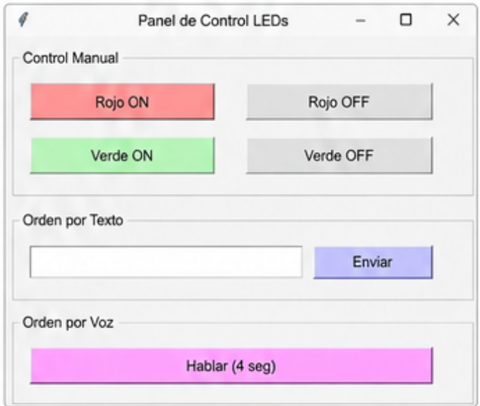
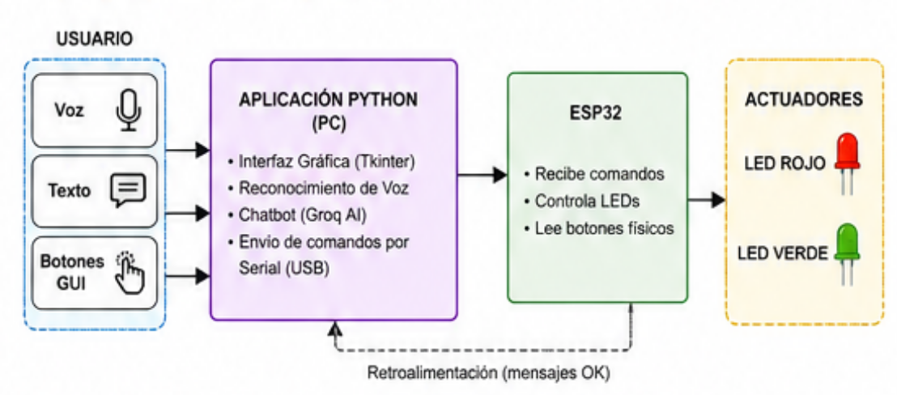

<h1><b>CHATBOT DOMOTICO PARA CONTROLAR LEDS POR VOZ</b></h1>

Para poder utlizar controlar el encendido y apagado de un led rojo y verde por comandos de voz utlizando un chat bot se creo un sistema
de control apoyado por el chat bot qrok ai.

<h2><b>vESP32 (MicroPython):</b> controla los LEDs y recibe comandos.</b></h2>

<pre><code>    
from machine import Pin
import sys
import select
import time

# =========================
# CONFIGURACIÓN DE LEDS
# =========================
rojo = Pin(26, Pin.OUT)
verde = Pin(27, Pin.OUT)

# Variables para guardar si el LED está prendido (1) o apagado (0)
estado_rojo = 0
estado_verde = 0

rojo.value(estado_rojo)
verde.value(estado_verde)

# =========================
# CONFIGURACIÓN PULSADORES
# =========================
pulsador_verde = Pin(12, Pin.IN, Pin.PULL_UP)
pulsador_rojo = Pin(14, Pin.IN, Pin.PULL_UP)

# Tiempos para evitar el "rebote" (que un pulso cuente doble)
ultimo_tiempo_v = 0
ultimo_tiempo_r = 0

# Configurar lectura del puerto serial sin bloquear el ciclo
poll_obj = select.poll()
poll_obj.register(sys.stdin, select.POLLIN)

print("ESP32 Lista y esperando comandos...")

while True:
    tiempo_actual = time.ticks_ms()

    # ==========================================
    # 1. CONTROL POR BOTONES FÍSICOS (Alternar)
    # ==========================================
    
    # Botón verde
    if pulsador_verde.value() == 0:
        if time.ticks_diff(tiempo_actual, ultimo_tiempo_v) > 300: # 300ms de espera
            estado_verde = not estado_verde # Alterna el estado
            verde.value(estado_verde)
            print("OK Verde", "Encendido" if estado_verde else "Apagado")
            ultimo_tiempo_v = tiempo_actual

    # Botón rojo
    if pulsador_rojo.value() == 0:
        if time.ticks_diff(tiempo_actual, ultimo_tiempo_r) > 300:
            estado_rojo = not estado_rojo
            rojo.value(estado_rojo)
            print("OK Rojo", "Encendido" if estado_rojo else "Apagado")
            ultimo_tiempo_r = tiempo_actual

    # ==========================================
    # 2. CONTROL POR SERIAL (Desde Python)
    # ==========================================
    eventos = poll_obj.poll(0)
    
    if eventos:
        comando = sys.stdin.readline().strip()
        
        if comando == "ROJO_ON":
            estado_rojo = 1
            rojo.value(estado_rojo)
            print("OK Rojo Encendido")
            
        elif comando == "ROJO_OFF":
            estado_rojo = 0
            rojo.value(estado_rojo)
            print("OK Rojo Apagado")
            
        elif comando == "VERDE_ON":
            estado_verde = 1
            verde.value(estado_verde)
            print("OK Verde Encendido")
            
        elif comando == "VERDE_OFF":
            estado_verde = 0
            verde.value(estado_verde)
            print("OK Verde Apagado")
            
        elif comando == "TODOS_ON":
            estado_rojo = 1
            estado_verde = 1
            rojo.value(estado_rojo)
            verde.value(estado_verde)
            print("OK Todos Encendidos")
            
        elif comando == "TODOS_OFF":
            estado_rojo = 0
            estado_verde = 0
            rojo.value(estado_rojo)
            verde.value(estado_verde)
            print("OK Todos Apagados")
</code></pre>

<h3><b>Interfaz gráfica</b></h3>

La aplicación cuenta con una interfaz gráfica que permite controlar los LEDs
manualmente mediante botones, enviar órdenes mediante texto y utilizar
comandos de voz mediante el chat bot.

    <!-- Colocar aquí la imagen de la interfaz gráfica -->
    

<h2><b>4. Código de la aplicación Python (PC)</b></h2>

Para el control por texto y voz se utlizo Groq AI, al cual se accede mediante una URL y una API Key. 
Se envía un texto con el contexto y la instrucción del usuario, y el chatbot responde 
con los comandos en formato JSON. Estos comandos son enviados por el puerto serial COM
para controlar el encendido y apagado de los LEDs.

<h3><b>Código Python de la interfaz</b></h3>

<pre>
<code>
import serial
import time
import speech_recognition as sr
from openai import OpenAI
import sounddevice as sd
import soundfile as sf
import os
import json
import tkinter as tk
import threading

# =========================================================
# 1. CONFIGURACIÓN
# =========================================================
PUERTO = 'COM3'
BAUDIOS = 115200
===========================================================
# AQUI VA LA API KEY
===========================================================
API_KEY = "API_KEY"

# =========================================================
# 2. CLASE DE LA INTERFAZ GRÁFICA
# =========================================================
class AppControlLED:
    def __init__(self, root):
        self.root = root
        self.root.title("Panel de Control LEDs")
        self.root.geometry("450x300")  # Ventana más pequeña y compacta
        self.root.resizable(False, False)

        # Configurar cliente Groq
        self.cliente_ia = OpenAI(
            api_key=API_KEY,
            base_url="https://api.groq.com/openai/v1"
        )

        self.conexion_serial = None
        
        self.crear_interfaz()
        self.conectar_serial()

    def conectar_serial(self):
        try:
            self.conexion_serial = serial.Serial(PUERTO, BAUDIOS, timeout=1)
            time.sleep(2)
            print(f"Microcontrolador conectado exitosamente en {PUERTO}")
        except serial.SerialException:
            print(f"Advertencia: No se pudo abrir {PUERTO}. Modo simulación activado.")

    def crear_interfaz(self):
        # --- SECCIÓN 1: Control Manual ---
        marco_manual = tk.LabelFrame(self.root, text="Control Manual", padx=10, pady=10)
        marco_manual.pack(padx=10, pady=10, fill="x")

        # Botones Rojos
        btn_rojo_on = tk.Button(marco_manual, text="Rojo ON", bg="#ffcccc", width=12, 
                                command=lambda: self.enviar_comando_directo("rojo_on"))
        btn_rojo_on.grid(row=0, column=0, padx=5, pady=5)

        btn_rojo_off = tk.Button(marco_manual, text="Rojo OFF", bg="#e6e6e6", width=12, 
                                 command=lambda: self.enviar_comando_directo("rojo_off"))
        btn_rojo_off.grid(row=0, column=1, padx=5, pady=5)

        # Botones Verdes
        btn_verde_on = tk.Button(marco_manual, text="Verde ON", bg="#ccffcc", width=12, 
                                 command=lambda: self.enviar_comando_directo("verde_on"))
        btn_verde_on.grid(row=1, column=0, padx=5, pady=5)

        btn_verde_off = tk.Button(marco_manual, text="Verde OFF", bg="#e6e6e6", width=12, 
                                  command=lambda: self.enviar_comando_directo("verde_off"))
        btn_verde_off.grid(row=1, column=1, padx=5, pady=5)

        # --- SECCIÓN 2: Control por Texto ---
        marco_texto = tk.LabelFrame(self.root, text="Orden por Texto", padx=10, pady=10)
        marco_texto.pack(padx=10, pady=5, fill="x")

        self.entrada_texto = tk.Entry(marco_texto, width=35)
        self.entrada_texto.pack(side="left", padx=5)

        btn_enviar_texto = tk.Button(marco_texto, text="Enviar", bg="#ccccff", 
                                     command=self.procesar_texto)
        btn_enviar_texto.pack(side="left", padx=5)

        # --- SECCIÓN 3: Control por Voz ---
        marco_voz = tk.LabelFrame(self.root, text="Orden por Voz", padx=10, pady=10)
        marco_voz.pack(padx=10, pady=5, fill="x")

        self.btn_voz = tk.Button(marco_voz, text="Hablar (4 seg)", bg="#ffccff", height=1, 
                                 command=self.procesar_voz)
        self.btn_voz.pack(fill="x", padx=5)

    # =========================================================
    # 3. LÓGICA DE LA APLICACIÓN
    # =========================================================

    def enviar_comando_directo(self, comando):
        """Envía comandos validados al microcontrolador."""
        if self.conexion_serial and self.conexion_serial.is_open:
            self.conexion_serial.write((comando + '\n').encode('utf-8'))
            print(f"ESP32: Enviado comando -> {comando}")
        else:
            print(f"Simulacion: {comando} (Puerto no conectado)")

    def interpretar_con_groq(self, texto_usuario):
        """Consulta a Groq para convertir lenguaje natural en comandos."""
        print("Chat Bot (Groq): Procesando la orden...")
        
        prompt = f"""
Analiza la siguiente orden en español para controlar dos LEDs.
Orden del usuario: "{texto_usuario}"
Los comandos posibles son únicamente:
- rojo_on
- rojo_off
- verde_on
- verde_off
Corrige automáticamente pequeños errores de escritura.
Devuelve los comandos correspondientes.
"""
        try:
            respuesta = self.cliente_ia.chat.completions.create(
                model="openai/gpt-oss-20b",
                messages=[{"role": "user", "content": prompt}],
                reasoning_effort="low",
                max_completion_tokens=500,
                response_format={
                    "type": "json_schema",
                    "json_schema": {
                        "name": "control_leds",
                        "strict": True,
                        "schema": {
                            "type": "object",
                            "properties": {
                                "comandos": {
                                    "type": "array",
                                    "items": {
                                        "type": "string",
                                        "enum": ["rojo_on", "rojo_off", "verde_on", "verde_off"]
                                    }
                                }
                            },
                            "required": ["comandos"],
                            "additionalProperties": False
                        }
                    }
                }
            )

            contenido = respuesta.choices[0].message.content
            print("Chat Bot (Groq): Respuesta recibida con éxito.")
            
            if not contenido: return []
            
            datos = json.loads(contenido)
            return datos.get("comandos", [])

        except Exception as e:
            print(f"Error conectando con Groq: {e}")
            return []

    # =========================================================
    # 4. FUNCIONES MULTIHILO (Para no congelar la GUI)
    # =========================================================

    def procesar_texto(self):
        texto = self.entrada_texto.get().strip()
        if texto:
            print(f"\nTexto ingresado: '{texto}'")
            self.entrada_texto.delete(0, tk.END)
            threading.Thread(target=self.ejecutar_orden, args=(texto,), daemon=True).start()

    def procesar_voz(self):
        self.btn_voz.config(state="disabled", text="Grabando...", bg="#ff6666")
        threading.Thread(target=self.hilo_grabar_voz, daemon=True).start()

    def hilo_grabar_voz(self):
        duracion = 4
        frecuencia = 44100
        archivo_temp = "temporal.wav"

        print("\nEscuchando por 4 segundos...")
        
        try:
            grabacion = sd.rec(int(duracion * frecuencia), samplerate=frecuencia, channels=1)
            sd.wait()
            sf.write(archivo_temp, grabacion, frecuencia)
            
            reconocedor = sr.Recognizer()
            with sr.AudioFile(archivo_temp) as source:
                audio_data = reconocedor.record(source)
                texto = reconocedor.recognize_google(audio_data, language="es-ES")
                
            print(f"Dijiste: '{texto}'")
            self.ejecutar_orden(texto)

        except sr.UnknownValueError:
            print("No pude entender el audio.")
        except Exception as e:
            print(f"Error con el micrófono: {e}")
        finally:
            if os.path.exists(archivo_temp):
                os.remove(archivo_temp)
            
            self.root.after(0, lambda: self.btn_voz.config(state="normal", text="Hablar (4 seg)", bg="#ffccff"))

    def ejecutar_orden(self, texto):
        comandos = self.interpretar_con_groq(texto)
        if comandos:
            print(f"Chat Bot (Groq) determinó ejecutar: {', '.join(comandos)}")
            for cmd in comandos:
                self.enviar_comando_directo(cmd)
                time.sleep(0.1)
        else:
            print("No se identificaron comandos válidos.")

# =========================================================
# 5. INICIO DEL PROGRAMA
# =========================================================
if __name__ == "__main__":
    ventana = tk.Tk()
    app = AppControlLED(ventana)
    
    def al_cerrar():
        if app.conexion_serial and app.conexion_serial.is_open:
            app.conexion_serial.close()
            print("Puerto serie cerrado. Saliendo...")
        ventana.destroy()
        
    ventana.protocol("WM_DELETE_WINDOW", al_cerrar)
    ventana.mainloop()
</code>
</pre>

<h2><b>Diagrama de bloques</b></h2>

    <!-- Colocar aquí la imagen del diagrama de bloques -->
    

<h2><b>Video de funcionamiento</b></h2>

    <!-- Cambiar el enlace por el video real -->
    <a href="https://youtu.be/EHqepvXtMkA" target="_blank">
        <b>Ver video de funcionamiento en YouTube</b>
    </a>

