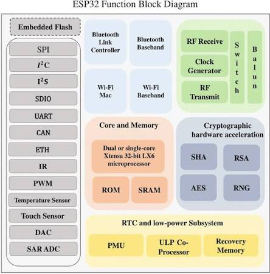
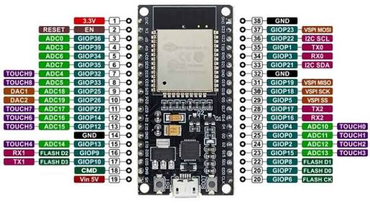

# **ESP-WROOM-32**

La **ESP-WROOM-32** es un módulo basado en el microcontrolador **ESP32**, desarrollado para aplicaciones de electrónica, automatización, robótica e Internet de las Cosas (IoT). Se caracteriza por integrar conectividad **Wi-Fi y Bluetooth**, además de diferentes periféricos para la conexión de sensores y actuadores.

## Estructura y arquitectura

La ESP-WROOM-32 posee una arquitectura basada en un microprocesador **Xtensa Dual-Core de 32 bits LX6**, memoria interna, conectividad inalámbrica y múltiples periféricos. Su estructura está compuesta principalmente por el procesador, memoria Flash (típicamente de 4 MB), memoria SRAM (520 KB), memoria ROM (448 KB), módulos Wi-Fi y Bluetooth, pines GPIO y sistemas de comunicación.

A continuación, se detalla el diagrama de bloques de sus funciones:

## Características de la ESP32

Entre sus principales características se encuentran:

- **Procesador:** Microprocesador Xtensa Dual-Core 32-bit LX6 (frecuencia hasta 240 MHz).
- **Memoria:** 
  - **SRAM:** 520 KB (para datos e instrucciones).
  - **ROM:** 448 KB (para el arranque y funciones del núcleo).
  - **Flash SPI:** Típicamente de 4 MB (utilizada para almacenar el código y datos).
- **Conectividad:** Wi-Fi (802.11 b/g/n) y Bluetooth (v4.2 BR/EDR y BLE).
- **Periféricos y E/S:**
  - Múltiples pines GPIO.
  - Entradas analógicas ADC y Conversores DAC.
  - Salidas PWM.
  - Interfaces de comunicación: UART, SPI, I2C, I2S, CAN y SDIO.
- **Eficiencia:** Bajo consumo de energía con soporte de coprocesador ULP (Ultra-Low Power) para el modo de suspensión.

## Conexiones y pines

Los pines GPIO de la ESP32 permiten conectar diferentes dispositivos electrónicos, como sensores, LEDs, motores y pantallas. Dependiendo de su configuración, pueden funcionar como entradas, salidas o cumplir funciones específicas.

## ADC

El **ADC (Conversor Analógico-Digital)** permite convertir señales analógicas en valores digitales. Esta función es utilizada para la lectura de sensores como potenciómetros, LDR y sensores analógicos de temperatura.

## PWM

La **PWM (Modulación por Ancho de Pulso)** permite generar señales con un ciclo de trabajo variable. Se utiliza principalmente para controlar el brillo de LEDs, la velocidad de motores y la posición de servomotores.

## DAC

El **DAC (Conversor Digital-Analógico)** permite generar una señal analógica a partir de un valor digital. En la ESP32 clásica, las salidas DAC se encuentran principalmente en:

- GPIO 25.
- GPIO 26.

## Programación en C/C++

### Ventajas

- Mayor velocidad de ejecución.
- Mayor control sobre el hardware.
- Amplio soporte de librerías.
- Adecuado para proyectos complejos.

### Desventajas

- Mayor dificultad de aprendizaje.
- Código más extenso.
- Requiere mayor conocimiento de programación.

## Programación en MicroPython

### Ventajas

- Sintaxis sencilla y fácil de aprender.
- Desarrollo rápido de programas.
- Ideal para proyectos educativos y prototipos.
- Permite realizar pruebas de forma rápida.

### Desventajas

- Menor velocidad de ejecución que C/C++.
- Mayor consumo de memoria.
- Algunas librerías y funciones pueden tener soporte limitado.
