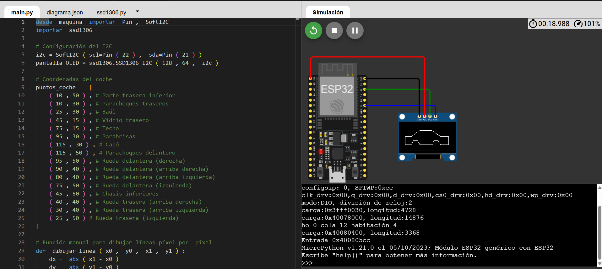

<h1 align="center">Primer Parcial - Microcontroladores </h1>

<strong>Integrantes:</strong>

<ul>
    <li>Jeicob David Pinilla Ruiz</li>
    <li>Fabian Abril Casallas</li>
</ul>

<h1 align="center">Generación de la figura de un auto en un osciloscopio por medio de la ESP-32</h1>

    Para generar la figura de un auto en la pantalla de un osciloscopio se utilizan los pines DAC de la ESP-32, específicamente el <strong>GPIO 25</strong> para controlar el eje X y el <strong>GPIO 26</strong> para controlar el eje Y. Estos pines cuentan con conversión digital a analógica, por lo que permiten generar diferentes niveles de voltaje. Al variar continuamente el voltaje de ambos pines dentro de su rango de funcionamiento, es posible controlar la posición horizontal y vertical del punto mostrado en la pantalla del osciloscopio configurado en modo X-Y.

    La figura del auto se genera mediante una serie de coordenadas almacenadas en las variables <code>ruta_x</code> y <code>ruta_y</code>. Cada par de valores representa una posición dentro de la pantalla, y al recorrer estas coordenadas en un orden determinado se pueden dibujar las diferentes partes de la silueta, como el chasis, el techo y las ruedas. La variación simultánea de los voltajes en los pines GPIO 25 y GPIO 26 hace que el punto de luz se desplace por cada una de estas posiciones hasta formar la figura completa del auto.

    Para obtener líneas más sólidas y evitar saltos bruscos entre las coordenadas, se utiliza una interpolación de puntos mediante la variable <code>pasos_por_linea = 20</code>. Un ciclo <code>for</code> genera posiciones intermedias entre cada par de coordenadas, logrando un movimiento gradual del punto de luz. Finalmente, todo el recorrido se repite constantemente mediante un ciclo <code>while True</code>. Gracias a este refresco continuo y a la persistencia de la visión, el ojo humano percibe una imagen fija de la silueta del auto en la pantalla.

<h2>Simulación en Wokwi</h2>

    Antes de probar la correcta generacion de la figura por medio del osciloscopio se 
    realizo la simulacion en Wokwi y por medio de una pantalla oled se mostro la figura.

<!-- Imagen de la simulación -->

    <strong>Enlace de la simulación:</strong>
    <a href="https://wokwi.com/projects/472703213305188353" target="_blank">
        Ver simulación en Wokwi
    </a>

<h2 align="center">Código Completo</h2>

<pre><code>

from machine import DAC, Pin

# Configuramos los DAC en los pines 25 y 26
dac_x = DAC(Pin(25)) # Eje X (Canal 1)
dac_y = DAC(Pin(26)) # Eje Y (Canal 2)

# Coordenadas rediseñadas para un solo trazo continuo
# Coordenadas rediseñadas con llantas y ventana (Un solo trazo continuo)
puntos_clave = [
    # --- CARROCERÍA EXTERIOR ---
    (20, 50),   # Parachoques trasero (abajo)
    (20, 90),   # Parachoques trasero (arriba)
    (45, 90),   # Baúl
    (75, 140),  # Techo (atrás)
    (135, 140), # Techo (frente)
    (165, 90),  # Capó
    (220, 90),  # Parachoques delantero (arriba)
    (220, 50),  # Parachoques delantero (abajo)

    # --- RUEDA DELANTERA (Dibujada hacia abajo y afuera) ---
    (180, 50),  # Inicio guardabarros
    (180, 20),  # Llanta (baja)
    (140, 20),  # Llanta (fondo)
    (140, 50),  # Fin guardabarros

    (80, 50),   # Chasis inferior medio

    # --- RUEDA TRASERA ---
    (80, 20),   # Llanta (baja)
    (40, 20),   # Llanta (fondo)
    (40, 50),   # Fin guardabarros

    (20, 50),   # Vuelta al origen (Cierra el chasis inferior)

    # --- TRUCO PARA LA VENTANA (Entrar, dibujar y salir por el mismo camino) ---
    (20, 90),   # Retrazamos hacia arriba por el parachoques
    (45, 90),   # Retrazamos el baúl
    (55, 95),   # Entramos al interior del auto
    (125, 95),  # Base de la ventana
    (120, 130), # Frente de la ventana
    (70, 130),  # Techo de la ventana
    (55, 95),   # Cerramos la ventana
    (45, 90)    # Salimos de vuelta al baúl (Para reiniciar el ciclo limpiamente)
]
# Listas para almacenar el trazo completo
ruta_x = []
ruta_y = []

# Resolución: cuántos puntos intermedios calculamos por cada línea recta
pasos_por_linea = 20 

# Generamos la interpolación (el recorrido suave entre puntos)
for i in range(len(puntos_clave)):
    p1 = puntos_clave[i]
    p2 = puntos_clave[(i + 1) % len(puntos_clave)]
    
    for paso in range(pasos_por_linea):
        t = paso / pasos_por_linea
        x = int(p1[0] + (p2[0] - p1[0]) * t)
        y = int(p1[1] + (p2[1] - p1[1]) * t)
        ruta_x.append(x)
        ruta_y.append(y)

# Bucle infinito para refrescar el osciloscopio
while True:
    for i in range(len(ruta_x)):
        dac_x.write(ruta_x[i])
        dac_y.write(ruta_y[i])  

</code></pre>

<h2>Demostración en Video</h2>

Mira el resultado final funcionando directamente en un osciloscopio real:

<a href="https://youtube.com/shorts/MMPqPZSSY4s" target="_blank">Ver video de funcionamiento en YouTube</a>

