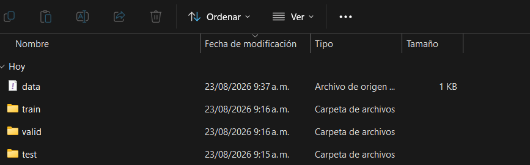
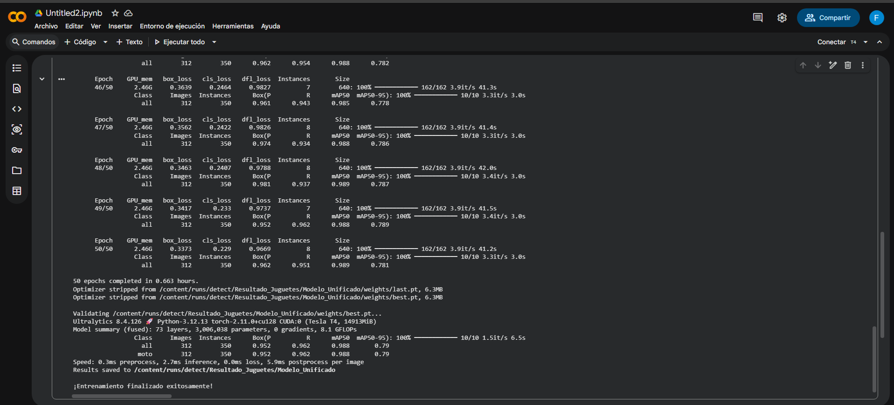

<h2 align="left"><b>Desarrollo del esquema en Wokwi</b></h2>

Primero se desarrolló el siguiente esquema en Wokwi, utilizando una ESP32, dos LEDs y dos pulsadores. Cada pulsador está asociado a un LED, permitiendo controlar su encendido y apagado.

  

  <a href="https://wokwi.com/projects/473182162418344961" target="_blank">
    <b>Ver proyecto en Wokwi</b>
  </a>

<h2 align="center"><b>Desarrollo del código en MicroPython</b></h2>

Posteriormente, se desarrolló el código en <b>MicroPython</b> para programar el funcionamiento de la ESP32. El código permite encender y apagar cada LED mediante su respectivo pulsador.

<h3 align="center"><b>Código MicroPython</b></h3>

<pre>
<code>
from machine import Pin
import time

# ==========================================
# LEDS
# ==========================================
rojo = Pin(26, Pin.OUT)
verde = Pin(25, Pin.OUT)

# ==========================================
# PULSADORES
# ==========================================
pulsador_rojo = Pin(13, Pin.IN, Pin.PULL_UP)
pulsador_verde = Pin(14, Pin.IN, Pin.PULL_UP)

# ==========================================
# BUCLE PRINCIPAL
# ==========================================
while True:

    # CONTROL POR PULSADORES
    if pulsador_rojo.value() == 0:
        rojo.value(1)
        verde.value(0)

    elif pulsador_verde.value() == 0:
        rojo.value(0)
        verde.value(1)

    else:
        rojo.value(0)
        verde.value(0)

    time.sleep_ms(10)

</code>
</pre>

<h1><b>Implementación de YOLO para la detección de motos y carros</b></h1>

<h2><b>¿Qué es YOLO?</b></h2>

<b>YOLO (You Only Look Once)</b> es un modelo de visión artificial utilizado para la detección de objetos en imágenes y videos. Su funcionamiento permite identificar diferentes objetos dentro de una imagen y determinar su ubicación mediante cuadros delimitadores (<i>bounding boxes</i>).

En este proyecto, YOLO se utilizó para identificar dos tipos de objetos: <b>motos</b> y <b>carros</b>. Dependiendo del objeto detectado, se envía una orden a la ESP32 para controlar los LEDs correspondientes.

<h2><b>Funcionamiento con la ESP32</b></h2>

La ESP32 se utiliza como dispositivo encargado de recibir las órdenes generadas por el programa de Python. De acuerdo con el objeto detectado por YOLO, la ESP32 puede encender el LED correspondiente.

El código utilizado en la ESP32 fue desarrollado en <b>MicroPython</b>. A continuación se deja el espacio para agregar el código utilizado:

<h3><b>Código de la ESP32</b></h3>

<pre>
<code>
from machine import Pin
import sys
import uselect
import time

# LEDS
rojo = Pin(26, Pin.OUT)
verde = Pin(27, Pin.OUT)

# ESTADO YOLO
deteccion_yolo = ""

# SERIAL
poll = uselect.poll()
poll.register(sys.stdin, uselect.POLLIN)

print("================================")
print("ESP32 LISTO (Solo YOLO, sin pulsadores)")
print("GPIO 27 -> LED VERDE (Moto)")
print("GPIO 26 -> LED ROJO (Carro)")
print("Esperando YOLO...")
print("================================")

# BUCLE PRINCIPAL
while True:

    # RECIBIR YOLO
    eventos = poll.poll(10)

    if eventos:
        dato = sys.stdin.readline().strip()
        print("Recibido:", dato)

        if dato == "CARRO":
            deteccion_yolo = "CARRO"

        elif dato == "MOTO":
            deteccion_yolo = "MOTO"

        elif dato == "NINGUNO":
            deteccion_yolo = ""

    # CONTROL DE LEDS SEGÚN YOLO
    if deteccion_yolo == "CARRO":
        rojo.value(1)
        verde.value(0)

    elif deteccion_yolo == "MOTO":
        rojo.value(0)
        verde.value(1)

    else:
        # Si recibe "NINGUNO" o está vacío, apaga ambos
        rojo.value(0)
        verde.value(0)

    time.sleep_ms(10)
</code>
</pre>

<h2><b>Obtención del conjunto de datos</b></h2>

Para realizar el proyecto se utilizó <b>Roboflow</b>, una plataforma que permitió obtener un conjunto de datos ya organizado y preparado para el entrenamiento del modelo de detección de objetos.

El archivo obtenido contenía las imágenes y los datos correspondientes a dos clases de objetos: <b>carros de juguete</b> y <b>motos de juguete</b>. De esta manera, no fue necesario crear y organizar manualmente el conjunto de datos desde cero.

El conjunto de datos estuvo compuesto por:

<ul>
  <li><b>1498 imágenes de motos de juguete.</b></li>
  <li><b>1096 imágenes de carros de juguete.</b></li>
</ul>

Estas imágenes y sus respectivos datos fueron utilizados posteriormente para entrenar el modelo YOLO, permitiendo que este aprendiera a diferenciar entre un carro de juguete y una moto de juguete.

El conjunto de datos fue obtenido mediante la plataforma 
<a href="https://roboflow.com/"><b>Roboflow</b></a>.

<h3><b>Conjunto de datos utilizado</b></h3>

  

<h2><b>Entrenamiento del modelo</b></h2>

Después de obtener el conjunto de datos desde <b>Roboflow</b>, se procedió a entrenar el modelo de <b>YOLO</b> para que pudiera reconocer un carro y una moto de juguete</b>.

Para realizar el entrenamiento se utilizó <b>Google Colab</b>, debido a que el poder computacional requerido es bastante alto y si se hiciera de manera local se demoraría horas aun así debido a que cantidad de imagenes  y datos era alta se demoro 40 minutos en generar el modelo.

<h3><b>Proceso de entrenamiento</b></h3>

  <!-- Colocar aquí la imagen del proceso de entrenamiento en Google Colab -->
  

<h3><b>Código utilizado para el entrenamiento</b></h3>

<pre>
<code>
import zipfile
import os

# 1. Descomprimir el dataset unificado
print("Descomprimiendo el dataset...")
# Busca automáticamente cualquier archivo .zip que hayas subido
zip_files = [f for f in os.listdir('.') if f.endswith('.zip')]
if zip_files:
    archivo_zip = zip_files[0]
    with zipfile.ZipFile(archivo_zip, 'r') as zip_ref:
        zip_ref.extractall('.')
    print(f"Archivo {archivo_zip} descomprimido con éxito.")
else:
    print("Error: No se encontró ningún archivo .zip subido.")

# 2. Configurar rutas del data.yaml para Colab
ruta_yaml = os.path.abspath("Dataset_Juguetes_Unificado/data.yaml")

yaml_content = f"""train: {os.path.abspath('Dataset_Juguetes_Unificado/train/images')}
val: {os.path.abspath('Dataset_Juguetes_Unificado/valid/images')}
test: {os.path.abspath('Dataset_Juguetes_Unificado/test/images')}

nc: 2
names: ['carro', 'moto']
"""

with open(ruta_yaml, 'w') as f:
    f.write(yaml_content)

# 3. Instalar Ultralytics y entrenar en la GPU
!pip install ultralytics

from ultralytics import YOLO

print("\nIniciando entrenamiento acelerado por GPU...")
model = YOLO("yolov8n.pt")

model.train(
    data=ruta_yaml,
    epochs=50,
    imgsz=640,
    project="Resultado_Juguetes",
    name="Modelo_Unificado"
)

print("\n¡Entrenamiento finalizado exitosamente!")
</code>
</pre>

<h2><b>Modelo generado</b></h2>

Una vez finalizado el entrenamiento, Google Colab generó el modelo entrenado el cual se encuentra disponible como best.pt.

<h2><b>Programa principal en Python</b></h2>

Después de entrenar el modelo, se desarrolló un programa en <b>Python</b> encargado de utilizar YOLO para realizar la detección de objetos y comunicarse con la ESP32 por medio del serial COM para poder encender el led rojo si detecta un carro y el led verde si detecta una moto.

El programa recibe la imagen de la cámara, ejecuta el modelo YOLO y determina si el objeto detectado corresponde a una <b>moto</b> o a un <b>carro</b>. Posteriormente, de acuerdo con el resultado de la detección, se envía la orden correspondiente a la ESP32.

<h3><b>Código principal de Python</b></h3>

<pre>
from ultralytics import YOLO
import cv2
import serial
import time
import os

# ==========================================
# 1. CONFIGURACIÓN SERIAL (ESP32)
# ==========================================
PUERTO = "COM3"
BAUDRATE = 115200

try:
    esp32 = serial.Serial(PUERTO, BAUDRATE, timeout=1)
    time.sleep(2)
    print(f"ESP32 conectado exitosamente en {PUERTO}")
except Exception as e:
    print(f"Error al conectar con el puerto {PUERTO}: {e}")
    exit()

# ==========================================
# 2. CARGAR AMBOS MODELOS
# ==========================================
print("Cargando modelo original para personas...")
modelo_base = YOLO("yolov8n.pt")

ruta_descargas = os.path.join(os.path.expanduser('~'), 'Downloads')
ruta_mi_modelo = os.path.join(ruta_descargas, "Modelo_Unificado", "weights", "best.pt")

if not os.path.exists(ruta_mi_modelo):
    ruta_mi_modelo = os.path.join(ruta_descargas, "Modelo_Unificado", "best.pt")
if not os.path.exists(ruta_mi_modelo):
    ruta_mi_modelo = os.path.join(ruta_descargas, "best.pt")

print(f"Cargando modelo de juguetes desde: {ruta_mi_modelo}")

try:
    modelo_juguetes = YOLO(ruta_mi_modelo)
    print("¡Ambos modelos cargados correctamente!")
except Exception as e:
    print(f"Error al cargar 'best.pt': {e}")
    exit()

# Función para verificar si dos cajas están en la misma posición (se cruzan)
def se_superponen(box1, box2):
    x1_max = max(box1[0], box2[0])
    y1_max = max(box1[1], box2[1])
    x2_min = min(box1[2], box2[2])
    y2_min = min(box1[3], box2[3])
    
    ancho = max(0, x2_min - x1_max)
    alto = max(0, y2_min - y1_max)
    area_interseccion = ancho * alto
    
    return area_interseccion > 0

# ==========================================
# 3. DETECCIÓN CON COMPARACIÓN DE CONFIANZA
# ==========================================
cap = cv2.VideoCapture(0)
ultima_deteccion = ""

while True:
    ret, frame = cap.read()
    if not ret:
        print("Error al acceder a la cámara.")
        break

    # Bajamos un poco los umbrales base para capturar los porcentajes de ambos
    res_base = modelo_base(frame, conf=0.80, verbose=False)
    res_juguetes = modelo_juguetes(frame, conf=0.60, verbose=False)

    # Lista de detecciones de personas: [caja_coordinates, confianza]
    personas_detectadas = []
    for r in res_base:
        for box in r.boxes:
            clase = int(box.cls[0])
            if modelo_base.names[clase] == "person":
                caja = box.xyxy[0].tolist()
                confianza = float(box.conf[0])
                personas_detectadas.append((caja, confianza))

    deteccion_juguete = ""

    # Analizar detecciones de tu modelo de juguetes
    for r in res_juguetes:
        for box in r.boxes:
            caja_juguete = box.xyxy[0].tolist()
            conf_juguete = float(box.conf[0])
            clase = int(box.cls[0])
            nombre = modelo_juguetes.names[clase].lower()

            es_valido = True

            # Comparar contra las personas detectadas en la misma zona
            for caja_persona, conf_persona in personas_detectadas:
                if se_superponen(caja_juguete, caja_persona):
                    # Si el porcentaje de PERSONA es mayor, descartamos la etiqueta de juguete
                    if conf_persona >= conf_juguete:
                        es_valido = False
                        break

            # Si tu modelo le ganó en precisión/confianza a la detección de persona
            if es_valido:
                if "carro" in nombre or "car" in nombre:
                    deteccion_juguete = "CARRO"
                elif "moto" in nombre or "motorcycle" in nombre:
                    deteccion_juguete = "MOTO"

    # Enviar datos al ESP32
    if deteccion_juguete != ultima_deteccion:
        if deteccion_juguete == "CARRO":
            esp32.write(b"CARRO\n")
            print(">>> CARRO DETECTADO (Mayor certeza que Persona)")
        elif deteccion_juguete == "MOTO":
            esp32.write(b"MOTO\n")
            print(">>> MOTO DETECTADA (Mayor certeza que Persona)")
        else:
            esp32.write(b"NINGUNO\n")
            print(">>> NINGÚN JUGUETE / PREVALECE PERSONA")

        ultima_deteccion = deteccion_juguete

    # Mostrar en pantalla
    frame_pantalla = res_base[0].plot(img=frame)
    frame_pantalla = res_juguetes[0].plot(img=frame_pantalla)
    cv2.imshow("Deteccion con Filtro por Porcentaje de Certeza", frame_pantalla)

    if cv2.waitKey(1) & 0xFF == ord('q'):
        break

# Cierre limpio
cap.release()
cv2.destroyAllWindows()
if esp32.is_open:
    esp32.close()
    print("Conexión serial cerrada.")
  
</code>
</pre>

Hay que destacar una cosa se tuvo que utilizar el modelo que trae Yolo por defecto ya que estaba detectado una persona como un carro y se tuvo que ajustar el valor de precisión para no confundir con otros objetos.

<h2><b>Funcionamiento del sistema</b></h2>

<h2><b>Video de funcionamiento</b></h2>

A continuación se encuentra el enlace al video donde se puede observar el funcionamiento completo del sistema, incluyendo la detección de los objetos mediante YOLO y la respuesta de la ESP32.

  <a href="https://youtu.be/LgYEPxgESHk" target="_blank">
    <b>Ver video de funcionamiento en YouTube</b>
  </a>

La camara tiene un pequeño retraso por eso el led rojo al final encendió después.

