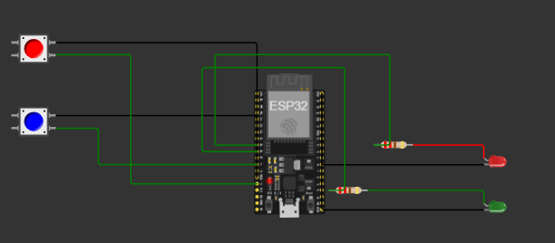

<h1 align="center"><b>YOLO</b></h1>

<h2 align="center"><b>Desarrollo del esquema en Wokwi</b></h2>

Primero se desarrolló el siguiente esquema en Wokwi, utilizando una ESP32, dos LEDs y dos pulsadores. Cada pulsador está asociado a un LED, permitiendo controlar su encendido y apagado.

  

  <a href="https://wokwi.com/projects/473182162418344961" target="_blank">
    <b>Ver proyecto en Wokwi</b>
  </a>

<h2 align="center"><b>Desarrollo del código en MicroPython</b></h2>

Posteriormente, se desarrolló el código en <b>MicroPython</b> para programar el funcionamiento de la ESP32. El código permite encender y apagar cada LED mediante su respectivo pulsador.

El funcionamiento del programa se explica mediante comentarios dentro del código, indicando la configuración de los pines, la lectura de los pulsadores y el control de los LEDs.

<h3 align="center"><b>Código utilizado</b></h3>

<pre>
<code>
# =========================================================
# CÓDIGO EN MICROPYTHON
# =========================================================

# Pegar aquí el código desarrollado en MicroPython.

</code>
</pre>

<h2 align="center"><b>Funcionamiento del sistema</b></h2>

El sistema funciona mediante dos pulsadores, donde cada uno controla un LED de forma independiente. Al presionar un pulsador, la ESP32 detecta su estado y modifica el estado del LED correspondiente.

<ul>
  <li>El primer pulsador controla el primer LED.</li>
  <li>El segundo pulsador controla el segundo LED.</li>
  <li>Cada LED puede encenderse y apagarse de manera independiente.</li>
  <li>El programa se ejecuta utilizando MicroPython en la ESP32.</li>
</ul>

Con este desarrollo se comprobó el funcionamiento del circuito mediante la simulación en <b>Wokwi</b> y la programación de la ESP32 utilizando <b>MicroPython</b>.

