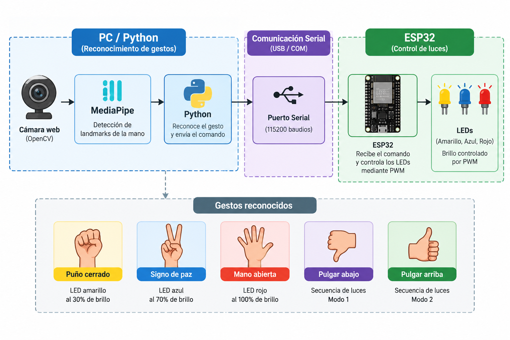

<strong>Integrantes:</strong>

<ul>
    <li>Jeicob David Pinilla Ruiz</li>
    <li>Fabian Abril Casallas</li>
</ul>

    <h1 align="center"><b>CONTROL DE LUCES CON GESTOS</b></h1>

Para reconocer los gestos se utiliza la camara del computador junto con Python y la biblioteca
MediaPipe. Los comandos reconocidos se envían mediante comunicación serial a la ESP32.

La ESP32 recibe los comandos y controla el brillo de los LEDS mediante PWM.
De esta manera los diferentes gestos de la mano permiten controlar el encendido de los LEDS
y ejecutar dos secuencias de enciendido diferentes.

<h2><b>Diagrama bloques</b></h2>

    

<h2><b>Funcionamiento</b></h2>

En el siguiente video se puede observar el funcionamiento incluyendo el reconocimiento
de los diferentes gestos y la respuesta de los LEDS.

    <!-- Reemplazar el enlace por el video real -->
    <a href="https://youtu.be/0vXCjzX6YHw" target="_blank">
        <b>Ver video del funcionamiento en YouTube</b>
    </a>

<h2><b>1. Código Python para reconocimiento de gestos</b></h2>

Este programa se ejecuta en visual, utlizando OpenCV para obtener la imagen de la cámara
y MediaPipe para detectar los puntos de referencia de la mano.
Dependiendo del gesto reconocido, se envía un comando por el puerto serial hacia la ESP32.

<pre>
<code>
import cv2
import math
import time
import serial
import mediapipe as mp

# =========================================================
# 1. CONFIGURACIÓN DE CÁMARA Y ESP32
# =========================================================

INDICE_CAMARA = 1
PUERTO_COM = 'COM3'
BAUD_RATE = 115200

# =========================================================
# 2. CONFIGURACIÓN DE MEDIAPIPE
# =========================================================

mp_hands = mp.solutions.hands
mp_drawing = mp.solutions.drawing_utils

hands = mp_hands.Hands(
    static_image_mode=False,
    max_num_hands=1,
    min_detection_confidence=0.7,
    min_tracking_confidence=0.7
)

# =========================================================
# 3. CONEXIÓN SERIAL CON ESP32
# =========================================================

try:
    esp32 = serial.Serial(
        PUERTO_COM,
        BAUD_RATE,
        timeout=0.1
    )

    time.sleep(2)

    print(f"Conectado a la ESP32 en {PUERTO_COM}")

except Exception as e:
    print(f"Advertencia: No se pudo abrir {PUERTO_COM} ({e})")
    print("Modo de prueba: solo visualización.")

    esp32 = None

# =========================================================
# 4. DETECCIÓN DE GESTOS
# =========================================================

def detectar_gesto(landmarks):

    wrist = landmarks[0]

    thumb_tip = landmarks[4]
    thumb_mcp = landmarks[2]

    index_pip = landmarks[6]
    middle_mcp = landmarks[9]

    # -----------------------------------------------------
    # Identificación de dedos levantados
    # -----------------------------------------------------

    indice_arriba = landmarks[8].y < landmarks[6].y
    medio_arriba = landmarks[12].y < landmarks[10].y
    anular_arriba = landmarks[16].y < landmarks[14].y
    menique_arriba = landmarks[20].y < landmarks[18].y

    dedos_extendidos = sum([
        indice_arriba,
        medio_arriba,
        anular_arriba,
        menique_arriba
    ])

    # -----------------------------------------------------
    # Escala de la mano
    # -----------------------------------------------------

    escala_mano = math.hypot(
        middle_mcp.x - wrist.x,
        middle_mcp.y - wrist.y
    )

    # -----------------------------------------------------
    # Distancia entre pulgar e índice
    # -----------------------------------------------------

    dist_pulgar_guardado = math.hypot(
        thumb_tip.x - index_pip.x,
        thumb_tip.y - index_pip.y
    )

    # -----------------------------------------------------
    # 1. Signo de victoria
    # -----------------------------------------------------

    if (
        indice_arriba
        and medio_arriba
        and not anular_arriba
        and not menique_arriba
    ):
        return '2', "Victoria (Nivel 70%)"

    # -----------------------------------------------------
    # 2. Palma abierta
    # -----------------------------------------------------

    if dedos_extendidos >= 3:
        return '3', "Palma Abierta (Nivel 100%)"

    # -----------------------------------------------------
    # 3. Puño, pulgar arriba o pulgar abajo
    # -----------------------------------------------------

    if dedos_extendidos == 0:

        # Puño cerrado
        if dist_pulgar_guardado < (escala_mano * 0.40):
            return '1', "Puño (Nivel 30%)"

        # Pulgar arriba
        if thumb_tip.y < thumb_mcp.y:
            return '5', "Pulgar Arriba (Secuencia 2)"

        # Pulgar abajo
        else:
            return '4', "Pulgar Abajo (Secuencia 1)"

    return None, "Gesto No Reconocido"

# =========================================================
# 5. BUCLE DE CAPTURA Y TRANSMISIÓN
# =========================================================

cap = cv2.VideoCapture(
    INDICE_CAMARA,
    cv2.CAP_DSHOW
)

ultimo_comando = None
ultimo_envio = 0

while cap.isOpened():

    ret, frame = cap.read()

    if not ret:
        break

    # -----------------------------------------------------
    # Procesamiento de imagen
    # -----------------------------------------------------

    frame = cv2.flip(frame, 1)

    rgb_frame = cv2.cvtColor(
        frame,
        cv2.COLOR_BGR2RGB
    )

    results = hands.process(rgb_frame)

    texto_gesto = "Esperando mano..."

    # -----------------------------------------------------
    # Detección de la mano
    # -----------------------------------------------------

    if results.multi_hand_landmarks:

        for hand_landmarks in results.multi_hand_landmarks:

            mp_drawing.draw_landmarks(
                frame,
                hand_landmarks,
                mp_hands.HAND_CONNECTIONS
            )

            comando, texto_gesto = detectar_gesto(
                hand_landmarks.landmark
            )

            # -------------------------------------------------
            # Envío del comando
            # -------------------------------------------------

            tiempo_actual = time.time()

            if (
                comando
                and (
                    comando != ultimo_comando
                    or (tiempo_actual - ultimo_envio > 1.0)
                )
            ):

                if esp32 and esp32.is_open:

                    esp32.write(
                        comando.encode()
                    )

                    print(
                        f"Enviado a ESP32: "
                        f"'{comando}' -> {texto_gesto}"
                    )

                ultimo_comando = comando
                ultimo_envio = tiempo_actual

    # -----------------------------------------------------
    # Interfaz visual
    # -----------------------------------------------------

    cv2.putText(
        frame,
        f"Estado: {texto_gesto}",
        (10, 40),
        cv2.FONT_HERSHEY_SIMPLEX,
        0.9,
        (0, 255, 0),
        2
    )

    cv2.imshow(
        "Controlador de Gestos - ESP32",
        frame
    )

    # -----------------------------------------------------
    # Salir presionando Q
    # -----------------------------------------------------

    if cv2.waitKey(1) & 0xFF == ord('q'):
        break

# =========================================================
# 6. FINALIZAR
# =========================================================

cap.release()

if esp32 and esp32.is_open:
    esp32.close()

cv2.destroyAllWindows()
</code>
</pre>

<h2><b>2. Código MicroPython para la ESP32</b></h2>

Este programa se ejecuta directamente en la ESP32 utilizando MicroPython, la ESP32 recibe los comandos enviados desde el computador mediante el puerto serial.
Dependiendo del comando recibido, controla el encendido y brillo de los LEDS mediante PWM.

<pre>
<code>
import sys
import time
import uselect

from machine import Pin, PWM

# =========================================================
# CONFIGURACIÓN PWM
# =========================================================

FREQ = 1000

led_30 = PWM(
    Pin(27),
    freq=FREQ,
    duty_u16=0
)

led_70 = PWM(
    Pin(26),
    freq=FREQ,
    duty_u16=0
)

led_100 = PWM(
    Pin(25),
    freq=FREQ,
    duty_u16=0
)

# =========================================================
# FUNCIÓN PARA FIJAR BRILLO
# =========================================================

def fijar_brillo(led_pwm, porcentaje):

    duty = int(
        (porcentaje / 100.0) * 65535
    )

    led_pwm.duty_u16(duty)

# =========================================================
# APAGAR TODOS LOS LEDS
# =========================================================

def apagar_todos():

    fijar_brillo(led_30, 0)
    fijar_brillo(led_70, 0)
    fijar_brillo(led_100, 0)

apagar_todos()

# =========================================================
# MODO 1 - PULGAR ABAJO
# =========================================================

def ejecutar_modo1():

    # 1. Amarillo 30%
    fijar_brillo(led_30, 30)
    time.sleep(1)

    # 2. Azul 70%
    fijar_brillo(led_70, 70)
    time.sleep(1)

    # 3. Rojo 100%
    fijar_brillo(led_100, 100)
    time.sleep(1)

    # 4. Apagar Rojo
    fijar_brillo(led_100, 0)
    time.sleep(1)

    # 5. Apagar Azul
    fijar_brillo(led_70, 0)
    time.sleep(1)

    # 6. Apagar Amarillo
    fijar_brillo(led_30, 0)
    time.sleep(1)

    apagar_todos()

# =========================================================
# MODO 2 - PULGAR ARRIBA
# =========================================================

def ejecutar_modo2():

    # 1. Rojo 100%
    fijar_brillo(led_100, 100)
    time.sleep(1)

    # 2. Azul 70%
    fijar_brillo(led_70, 70)
    time.sleep(1)

    # 3. Amarillo 30%
    fijar_brillo(led_30, 30)
    time.sleep(1)

    # 4. Apagar Amarillo
    fijar_brillo(led_30, 0)
    time.sleep(1)

    # 5. Apagar Azul
    fijar_brillo(led_70, 0)
    time.sleep(1)

    # 6. Apagar Rojo
    fijar_brillo(led_100, 0)
    time.sleep(1)

    apagar_todos()

# =========================================================
# LEER PUERTO SERIAL
# =========================================================

poll_obj = uselect.poll()

poll_obj.register(
    sys.stdin,
    uselect.POLLIN
)

print(
    "ESP32 lista en MicroPython "
    "(Modo PWM Activo)..."
)

# =========================================================
# BUCLE PRINCIPAL
# =========================================================

while True:

    if poll_obj.poll(10):

        comando = sys.stdin.read(1)

        # -------------------------------------------------
        # Puño cerrado
        # -------------------------------------------------

        if comando == "1":

            apagar_todos()

            fijar_brillo(
                led_30,
                30
            )

        # -------------------------------------------------
        # Signo de victoria
        # -------------------------------------------------

        elif comando == "2":

            apagar_todos()

            fijar_brillo(
                led_70,
                70
            )

        # -------------------------------------------------
        # Palma abierta
        # -------------------------------------------------

        elif comando == "3":

            apagar_todos()

            fijar_brillo(
                led_100,
                100
            )

        # -------------------------------------------------
        # Pulgar abajo
        # -------------------------------------------------

        elif comando == "4":

            ejecutar_modo1()

        # -------------------------------------------------
        # Pulgar arriba
        # -------------------------------------------------

        elif comando == "5":

            ejecutar_modo2()
</code>
</pre>

