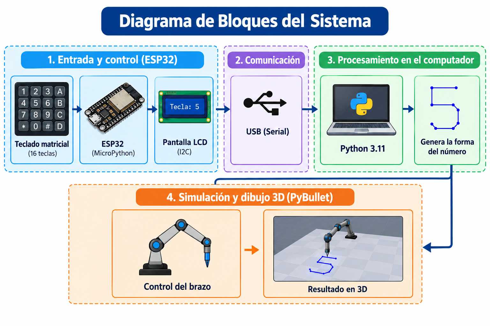
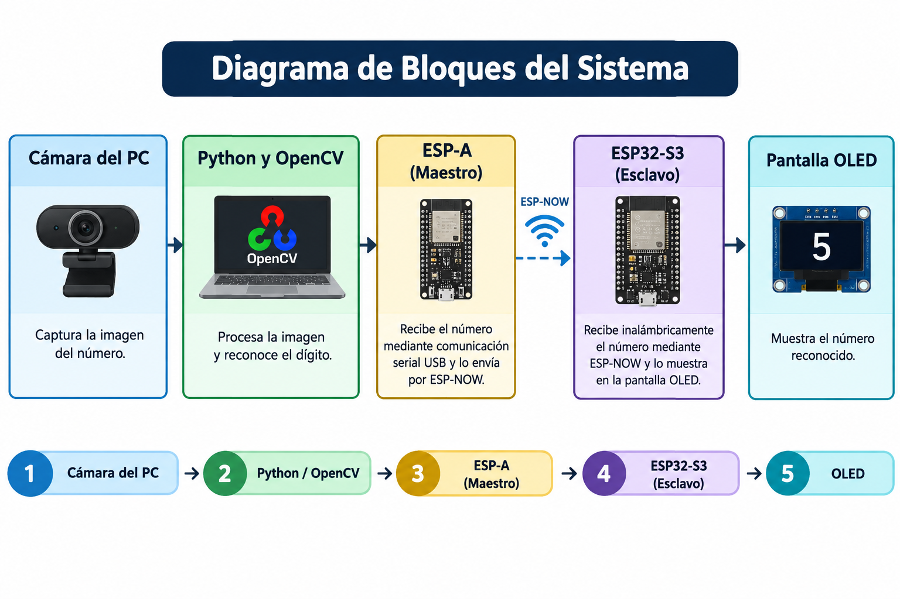

<strong>Integrantes:</strong>

<ul>
    <li>Jeicob David Pinilla Ruiz</li>
    <li>Fabian Abril Casallas</li>
</ul>

<h1><b>PUNTO 1</b></h1>

Por medio de un teclado matricial se ingresa un numero de 0-9 
el cual se visualiza en una LCD 16X2 controlada por una ESP 32 
que envia el numero por medio del puerto serial al computador 
para que se visualice el como el brazo dibuja el numero en Pybullet.

<h2><b>Python 3.11</b></h2>

Para poder usar Pybullet en pyton fue necesario utilizar la version
<strong>3.11</strong> de pyton ya que esta version tiene mayor compatibilidad
con Pybullet.

<pre><code># Creación y activación del entorno virtual en Windows

python3.11 -m venv venv
venv\Scripts\activate

# Instalación de las librerías necesarias

pip install pybullet pyserial
</code></pre>

Como ya tenia instalado <strong>Pyton 3.14</strong> fue necesario 
descargar <strong>Pyton 3.11</strong> y activarlo en entorno virtual
para poder alternar entre ambas versiones y no estar instalando y
desinstalando cada version.

<h2><b>Funcionamiento</b></h2>

<h3><b>1. Captura de datos mediante MicroPython</b></h3>

La ESP32 lee constantemente el teclado. Cuando se presiona un
boton, el programa aplica un filtro antirrebote para evitar lecturas duplicadas.
Posteriormente muestra la tecla presionada en la pantalla LCD y envía el número
a la computadora mediante el puerto serial.

<h3><b>2. Recepción de datos en el computador</b></h3>

Un programa desarrollado en Python recibe los datos enviados 
por la ESP32, Cuando recibe un número válido entre 0 y 9 
manda la orden para dibujar el numero.

<h3><b>3. Dibujo del numero</b></h3>

El programa contiene las instrucciones geométricas necesarias para representar
cada número. Los puntos correspondientes al numero son ajustados al tamaño
adecuado y posteriormente rotados para que el número quede orientado.

<h3><b>4. Movimiento del brazo y dibujo 3D</b></h3>

El motor de simulación calcula las posiciones necesarias de las articulaciones
del brazo para alcanzar cada punto. A medida que la punta del brazo se desplaza 
se genera un rastro que representa el dibujo.
Cuando el número contiene partes separadas, como ocurre con algunos trazos del
número 4, el brazo levanta el lápiz antes de desplazarse hacia la siguiente
posición.

Codigo ESP32

<pre>
<code>

from machine import Pin, I2C
import time

# =========================================================
# 1. CLASE CONTROLADORA PARA PANTALLA LCD I2C (16x2 / 20x4)
# =========================================================

class I2cLcd:
    def __init__(self, i2c, i2c_addr, num_lines=2, num_columns=16):
        self.i2c = i2c
        self.i2c_addr = i2c_addr
        self.num_lines = num_lines
        self.num_columns = num_columns
        self.backlight = 0x08

        time.sleep_ms(20)

        self.write_cmd(0x03)
        time.sleep_ms(5)

        self.write_cmd(0x03)
        time.sleep_ms(1)

        self.write_cmd(0x03)
        self.write_cmd(0x02)

        self.write_cmd(0x28)
        self.write_cmd(0x0C)
        self.write_cmd(0x06)

        self.clear()

    def write_cmd(self, cmd):
        self.send(cmd, 0)

    def write_char(self, char):
        self.send(ord(char), 1)

    def send(self, data, mode):
        high = mode | (data & 0xF0) | self.backlight
        low = mode | ((data << 4) & 0xF0) | self.backlight

        self.i2c.writeto(
            self.i2c_addr,
            bytes([
                high | 0x04,
                high,
                low | 0x04,
                low
            ])
        )

    def clear(self):
        self.write_cmd(0x01)
        time.sleep_ms(2)

    def move_to(self, col, row):
        addr = col & 0x3F

        if row & 1:
            addr += 0x40

        if row & 2:
            addr += 0x14

        self.write_cmd(0x80 | addr)

    def putstr(self, string):
        for char in string:
            self.write_char(char)

# =========================================================
# 2. INICIALIZACIÓN DE PERIFÉRICOS
# =========================================================

# Bus I2C para LCD
# GPIO 21 = SDA
# GPIO 22 = SCL

i2c = I2C(
    0,
    scl=Pin(22),
    sda=Pin(21),
    freq=400000
)

# =========================================================
# ESCANEO AUTOMÁTICO DE LA DIRECCIÓN I2C
# =========================================================

devices = i2c.scan()

if len(devices) == 0:

    print("Error: No se encontró ninguna pantalla LCD I2C conectada.")
    lcd = None

else:

    lcd_addr = devices[0]

    print(
        f"LCD detectado en la dirección: {hex(lcd_addr)}"
    )

    lcd = I2cLcd(
        i2c,
        lcd_addr,
        2,
        16
    )

    lcd.clear()

    lcd.move_to(0, 0)
    lcd.putstr(" Teclado + ESP32")

    lcd.move_to(0, 1)
    lcd.putstr("Tecla: ")

# =========================================================
# 3. MAPA Y PINES DEL TECLADO MATRICIAL
# =========================================================

KEYS = [
    ['1', '2', '3', 'A'],
    ['4', '5', '6', 'B'],
    ['7', '8', '9', 'C'],
    ['*', '0', '#', 'D']
]

ROW_PINS = [13, 12, 14, 27]
COL_PINS = [26, 25, 33, 32]

# Configuración de filas y columnas

rows = [
    Pin(p, Pin.OUT)
    for p in ROW_PINS
]

cols = [
    Pin(p, Pin.IN, Pin.PULL_UP)
    for p in COL_PINS
]

# Inicializar filas en estado HIGH

for r in rows:
    r.value(1)

# =========================================================
# 4. LECTURA DEL TECLADO
# =========================================================

def read_keypad():

    for row_idx, r in enumerate(rows):

        r.value(0)

        for col_idx, c in enumerate(cols):

            if c.value() == 0:

                # Antirrebote
                time.sleep_ms(20)

                # Esperar hasta soltar la tecla
                while c.value() == 0:
                    time.sleep_ms(10)

                r.value(1)

                return KEYS[row_idx][col_idx]

        r.value(1)

    return None

# =========================================================
# 5. BUCLE PRINCIPAL
# =========================================================

print("Sistema iniciado. Presiona una tecla...")

while True:

    key = read_keypad()

    if key:

        # Enviar tecla por puerto serial
        print(key)

        # Mostrar tecla en LCD
        if lcd:

            lcd.move_to(7, 1)
            lcd.putstr(f"{key}  ")

    time.sleep_ms(10)    
    
</code>
</pre>

Codigo Pyton

<pre>
<code>
import pybullet as p
import pybullet_data
import serial
import time
import os
import math

# ============================================================
# CONFIGURACIÓN DEL PUERTO SERIAL Y RUTAS
# ============================================================

PUERTO_COM = "COM3"
BAUDIOS = 115200

RUTA_URDF = r"C:\Users\fabia\Downloads\brazo.urdf"

# ============================================================
# CONEXIÓN SERIAL
# ============================================================

try:
    ser = serial.Serial(PUERTO_COM, BAUDIOS, timeout=0.1)

    print("--------------------------------------------")
    print("Puerto serial conectado correctamente")
    print("Puerto:", PUERTO_COM, "| Baudios:", BAUDIOS)
    print("--------------------------------------------")

    time.sleep(2)

except Exception as e:
    print("ERROR: No se pudo abrir el puerto serial\n", e)

# ============================================================
# INICIAR PYBULLET
# ============================================================

print("Iniciando PyBullet...")

physicsClient = p.connect(p.GUI)

if physicsClient &lt; 0:
    print("ERROR: No se pudo iniciar PyBullet")
    exit()

p.setAdditionalSearchPath(pybullet_data.getDataPath())
p.setGravity(0, 0, -9.81)
p.loadURDF("plane.urdf")

# ============================================================
# VERIFICAR ARCHIVO URDF
# ============================================================

if not os.path.exists(RUTA_URDF):

    print(
        "\nERROR: No se encontró el archivo URDF\n",
        RUTA_URDF
    )

    p.disconnect()

    if 'ser' in locals() and ser.is_open:
        ser.close()

    exit()

# ============================================================
# CARGAR BRAZO ROBÓTICO
# ============================================================

print("Cargando brazo robótico...")

robot = p.loadURDF(
    RUTA_URDF,
    basePosition=[0, 0, 0],
    useFixedBase=True
)

# ============================================================
# ÍNDICES DE ARTICULACIONES
# ============================================================

JOINT_BASE = 0
JOINT_BRAZO = 1
JOINT_GRIPPER = 2

END_EFFECTOR = 2

# ============================================================
# FUNCIONES DE CONTROL Y DIBUJO
# ============================================================

def obtener_punta():

    estado = p.getLinkState(
        robot,
        END_EFFECTOR,
        computeForwardKinematics=True
    )

    return estado[4]

def dibujar_linea(p1, p2):

    p.addUserDebugLine(
        p1,
        p2,
        lineColorRGB=[1, 0, 0],
        lineWidth=5,
        lifeTime=0
    )

def mover_a_punto(x, y, z):

    joint_poses = p.calculateInverseKinematics(
        robot,
        END_EFFECTOR,
        [x, y, z],
        maxNumIterations=100,
        residualThreshold=1e-4
    )

    p.setJointMotorControlArray(
        bodyIndex=robot,
        jointIndices=[
            JOINT_BASE,
            JOINT_BRAZO,
            JOINT_GRIPPER
        ],
        controlMode=p.POSITION_CONTROL,
        targetPositions=joint_poses[:3],
        forces=[120, 120, 60]
    )

    for _ in range(15):
        p.stepSimulation()
        time.sleep(1 / 240)

# ============================================================
# TRAYECTORIAS Y ROTACIÓN DE NÚMEROS
# ============================================================

TAMAÑO = 0.50

CX = 0.35
CY = 0.00
CZ = 0.25

def generar_numero(numero):

    s = TAMAÑO
    trazos = []

    def transformar(lx, ly):

        ly = -ly

        dx_rot = ly * s
        dy_rot = -lx * s

        return [
            CX + dx_rot,
            CY + dy_rot,
            CZ
        ]

    def linea_local(x1, y1, x2, y2, pasos=10):

        puntos = []

        for i in range(pasos + 1):

            t = i / pasos

            lx = x1 + (x2 - x1) * t
            ly = y1 + (y2 - y1) * t

            puntos.append(transformar(lx, ly))

        return puntos

    if numero == "0":

        trazo = []

        for i in range(31):

            t = 2 * math.pi * i / 30

            trazo.append(
                transformar(
                    0.3 * math.cos(t),
                    0.4 * math.sin(t)
                )
            )

        trazos.append(trazo)

    elif numero == "1":

        trazos.append(
            linea_local(0, -0.4, 0, 0.4)
        )

    elif numero == "2":

        t = linea_local(-0.4, 0.4, 0.4, 0.4)
        t += linea_local(0.4, 0.4, -0.4, -0.4)
        t += linea_local(-0.4, -0.4, 0.4, -0.4)

        trazos.append(t)

    elif numero == "3":

        t = linea_local(-0.4, 0.4, 0.4, 0.4)
        t += linea_local(0.4, 0.4, -0.4, 0)
        t += linea_local(-0.4, 0, 0.4, 0)
        t += linea_local(0.4, 0, -0.4, -0.4)

        trazos.append(t)

    elif numero == "4":

        trazos.append(
            linea_local(-0.4, 0.4, -0.4, 0)
            +
            linea_local(-0.4, 0, 0.4, 0)
        )

        trazos.append(
            linea_local(0.4, 0.4, 0.4, -0.4)
        )

    elif numero == "5":

        t = linea_local(0.4, 0.4, -0.4, 0.4)
        t += linea_local(-0.4, 0.4, -0.4, 0)
        t += linea_local(-0.4, 0, 0.4, 0)
        t += linea_local(0.4, 0, 0.4, -0.4)
        t += linea_local(0.4, -0.4, -0.4, -0.4)

        trazos.append(t)

    elif numero == "6":

        t = linea_local(0.4, 0.4, -0.4, 0.4)
        t += linea_local(-0.4, 0.4, -0.4, -0.4)
        t += linea_local(-0.4, -0.4, 0.4, -0.4)
        t += linea_local(0.4, -0.4, 0.4, 0)
        t += linea_local(0.4, 0, -0.4, 0)

        trazos.append(t)

    elif numero == "7":

        t = linea_local(-0.4, 0.4, 0.4, 0.4)
        t += linea_local(0.4, 0.4, 0.0, -0.4)

        trazos.append(t)

    elif numero == "8":

        t_sup = []
        t_inf = []

        for i in range(21):

            t = 2 * math.pi * i / 20

            t_sup.append(
                transformar(
                    0.25 * math.cos(t),
                    0.2 + 0.2 * math.sin(t)
                )
            )

            t_inf.append(
                transformar(
                    0.25 * math.cos(t),
                    -0.2 + 0.2 * math.sin(t)
                )
            )

        trazos.append(t_sup)
        trazos.append(t_inf)

    elif numero == "9":

        trazo = []

        for i in range(21):

            t = 2 * math.pi * i / 20

            trazo.append(
                transformar(
                    0.25 * math.cos(t),
                    0.2 + 0.2 * math.sin(t)
                )
            )

        trazo += linea_local(
            0.25,
            0.2,
            0.25,
            -0.4
        )

        trazos.append(trazo)

    return trazos

# ============================================================
# DIBUJAR NÚMERO
# ============================================================

def dibujar_numero(numero):

    print("\nDIBUJANDO NUMERO:", numero)

    p.removeAllUserDebugItems()

    trazos = generar_numero(numero)

    if not trazos:
        print("Número no configurado")
        return

    for trazo in trazos:

        if not trazo:
            continue

        mover_a_punto(
            trazo[0][0],
            trazo[0][1],
            trazo[0][2] + 0.06
        )

        mover_a_punto(
            trazo[0][0],
            trazo[0][1],
            trazo[0][2]
        )

        punto_anterior = obtener_punta()

        for punto in trazo[1:]:

            mover_a_punto(
                punto[0],
                punto[1],
                punto[2]
            )

            posicion_actual = obtener_punta()

            dibujar_linea(
                punto_anterior,
                posicion_actual
            )

            punto_anterior = posicion_actual

        mover_a_punto(
            punto_anterior[0],
            punto_anterior[1],
            punto_anterior[2] + 0.06
        )

    print("Número", numero, "terminado")

# ============================================================
# BUCLE PRINCIPAL
# ============================================================

print("\nEsperando números desde la ESP32...\n")

while True:

    try:

        if (
            'ser' in locals()
            and ser.is_open
            and ser.in_waiting > 0
        ):

            datos = (
                ser.readline()
                .decode("utf-8", errors="ignore")
                .strip()
            )

            if datos in list("0123456789"):

                dibujar_numero(datos)

            elif datos:

                print(
                    "Dato no reconocido:",
                    datos
                )

    except Exception:
        pass

    p.stepSimulation()
    time.sleep(1 / 240)
</code>
</pre>

<h2><b>Diagrama de bloques</b></h2>

    <!-- Colocar aquí la imagen del diagrama de bloques -->
    

<h2><b>Video de funcionamiento</b></h2>

    <!-- Colocar aquí el enlace del video -->
    <a href="https://youtu.be/UvwNwgkJg9M" target="_blank">
        <b>Ver video de funcionamiento</b>
    </a>

<h1><b>PUNTO 2</b></h1>

Mediante openCV y comuniacion SPI se detecta un numero dibujado
el cual se envia por medio del protocolo de comunicacion ESP NOW
entre dos ESP una maestro y otra esclavo de tal manera que una
esta conectada al computador y reconoce el numero 
y se lo envia a la otra para que lo muestre en una pantalla OLED.

<h2><b>2. Diagrama de Bloques</b></h2>

    

<h2><b>3. Funcionamiento </b></h2>

<h3><b>Código 1: Reconocimiento con Python y OpenCV</b></h3>

<pre>
<code>
import cv2
import numpy as np
import serial
import time

# ============================================================
# CONFIGURACIÓN
# ============================================================

PUERTO = "COM10"
BAUDRATE = 115200
CAMARA = 1

TIEMPO_ENTRE_ENVIOS = 1.0
TAMANO = 100

# ============================================================
# CONEXIÓN CON ESP-A
# ============================================================

try:
    esp = serial.Serial(
        PUERTO,
        BAUDRATE,
        timeout=1
    )
    time.sleep(2)
    print("ESP-A conectado.")
    print("Cámara iniciada.")
    print("Coloca un número del 0 al 9 dentro del cuadro.")
    print("Presiona Q para salir.\n")

except Exception as error:
    print("Error conectando con ESP-A:")
    print(error)
    exit()

# ============================================================
# CÁMARA
# ============================================================

cap = cv2.VideoCapture(CAMARA)

if not cap.isOpened():
    print("No se pudo abrir la cámara.")
    esp.close()
    exit()

cap.set(cv2.CAP_PROP_FRAME_WIDTH, 640)
cap.set(cv2.CAP_PROP_FRAME_HEIGHT, 480)

# ============================================================
# CREAR PLANTILLAS DIVERSAS
# Incluye trazos manuales de 2 y 4
# ============================================================

def crear_plantillas():

    plantillas = {i: [] for i in range(10)}

    # 1. Plantillas base con fuente de computadora
    for numero in range(10):

        imagen = np.zeros(
            (TAMANO, TAMANO),
            dtype=np.uint8
        )

        texto = str(numero)

        tam = cv2.getTextSize(
            texto,
            cv2.FONT_HERSHEY_SIMPLEX,
            2.6,
            7
        )[0]

        x = (TAMANO - tam[0]) // 2
        y = (TAMANO + tam[1]) // 2

        cv2.putText(
            imagen,
            texto,
            (x, y),
            cv2.FONT_HERSHEY_SIMPLEX,
            2.6,
            255,
            7,
            cv2.LINE_AA
        )

        plantillas[numero].append(imagen)

    # 2. Plantilla extra para el 2
    # Trazo clásico a mano
    img_2 = np.zeros(
        (TAMANO, TAMANO),
        dtype=np.uint8
    )

    cv2.ellipse(
        img_2,
        (50, 30),
        (25, 20),
        0,
        180,
        360,
        255,
        8
    )

    cv2.line(
        img_2,
        (75, 30),
        (25, 85),
        255,
        8
    )

    cv2.line(
        img_2,
        (25, 85),
        (80, 85),
        255,
        8
    )

    plantillas[2].append(img_2)

    # 3. Plantillas extra para el 4
    # Abierto, estilo cruz de marcador

    img_4_1 = np.zeros(
        (TAMANO, TAMANO),
        dtype=np.uint8
    )

    cv2.line(
        img_4_1,
        (30, 20),
        (30, 60),
        255,
        9
    )

    cv2.line(
        img_4_1,
        (30, 60),
        (85, 60),
        255,
        9
    )

    cv2.line(
        img_4_1,
        (65, 20),
        (65, 95),
        255,
        9
    )

    plantillas[4].append(img_4_1)

    img_4_2 = np.zeros(
        (TAMANO, TAMANO),
        dtype=np.uint8
    )

    cv2.line(
        img_4_2,
        (20, 20),
        (20, 55),
        255,
        9
    )

    cv2.line(
        img_4_2,
        (20, 55),
        (90, 55),
        255,
        9
    )

    cv2.line(
        img_4_2,
        (70, 15),
        (70, 95),
        255,
        9
    )

    plantillas[4].append(img_4_2)

    return plantillas

plantillas = crear_plantillas()

# ============================================================
# NORMALIZAR Y EXTRAER NÚMERO
# ============================================================

def normalizar_numero(binaria):

    # Encontrar contornos externos
    # para aislar el número

    contornos, _ = cv2.findContours(
        binaria,
        cv2.RETR_EXTERNAL,
        cv2.CHAIN_APPROX_SIMPLE
    )

    if not contornos:
        return None, None

    alto_img, ancho_img = binaria.shape

    margen = 6
    contornos_validos = []

    for c in contornos:

        x, y, w, h = cv2.boundingRect(c)
        area = cv2.contourArea(c)

        # Filtrar bordes tocando los extremos
        # Mano o borde del papel

        if (
            x &lt; margen
            or y &lt; margen
            or (x + w) > (ancho_img - margen)
            or (y + h) > (alto_img - margen)
        ):
            continue

        if area > 200:
            contornos_validos.append(c)

    if not contornos_validos:
        return None, None

    # Seleccionar el contorno principal

    contorno_ppal = max(
        contornos_validos,
        key=cv2.contourArea
    )

    x, y, w, h = cv2.boundingRect(contorno_ppal)

    if w &lt;= 0 or h &lt;= 0:
        return None, None

    recorte_binario = binaria[
        y:y + h,
        x:x + w
    ]

    # Escalar manteniendo aspecto

    escala = min(
        68.0 / w,
        68.0 / h
    )

    nuevo_ancho = max(
        1,
        int(w * escala)
    )

    nuevo_alto = max(
        1,
        int(h * escala)
    )

    recorte_resized = cv2.resize(
        recorte_binario,
        (nuevo_ancho, nuevo_alto),
        interpolation=cv2.INTER_AREA
    )

    resultado = np.zeros(
        (TAMANO, TAMANO),
        dtype=np.uint8
    )

    x_c = (TAMANO - nuevo_ancho) // 2
    y_c = (TAMANO - nuevo_alto) // 2

    resultado[
        y_c:y_c + nuevo_alto,
        x_c:x_c + nuevo_ancho
    ] = recorte_resized

    info = {
        'w': w,
        'h': h,
        'aspect_ratio': float(h) / max(1, w)
    }

    return resultado, info

# ============================================================
# COMPARACIÓN CON TRANSFORMADA DE DISTANCIA
# CHAMFER
# ============================================================

def calcular_distancia_chamfer(
    img_num,
    plantilla
):

    dist_plantilla = cv2.distanceTransform(
        255 - plantilla,
        cv2.DIST_L2,
        3
    )

    dist_img = cv2.distanceTransform(
        255 - img_num,
        cv2.DIST_L2,
        3
    )

    pts_img = img_num > 0
    pts_plantilla = plantilla > 0

    if not np.any(pts_img) or not np.any(pts_plantilla):
        return 999.0

    d1 = np.mean(
        dist_plantilla[pts_img]
    )

    d2 = np.mean(
        dist_img[pts_plantilla]
    )

    return (d1 + d2) / 2.0

# ============================================================
# CLASIFICACIÓN TOPOLÓGICA Y ESTRUCTURAL
# ============================================================

def reconocer_numero(binaria):

    norm, info = normalizar_numero(binaria)

    if norm is None:
        return None

    # Contar agujeros internos con RETR_CCOMP

    contornos_comp, jerarquia = cv2.findContours(
        norm,
        cv2.RETR_CCOMP,
        cv2.CHAIN_APPROX_SIMPLE
    )

    num_agujeros = 0
    agujeros_info = []

    if jerarquia is not None:

        jer = jerarquia[0]

        for i in range(len(contornos_comp)):

            # Si el contorno tiene padre
            # es un hueco interno

            if jer[i][3] != -1:

                area_h = cv2.contourArea(
                    contornos_comp[i]
                )

                if area_h > 25:

                    num_agujeros += 1

                    hx, hy, hw, hh = cv2.boundingRect(
                        contornos_comp[i]
                    )

                    agujeros_info.append(
                        (
                            hy + hh / 2.0,
                            area_h
                        )
                    )

    aspect_ratio = info['aspect_ratio']

    # --------------------------------------------------------
    # CASO 1: 2 AGUJEROS
    # Definitivamente es un 8
    # --------------------------------------------------------

    if num_agujeros >= 2:
        return 8

    # --------------------------------------------------------
    # CASO 2: 1 AGUJERO
    # Candidatos: 0, 6, 9, 4 cerrado
    # --------------------------------------------------------

    if num_agujeros == 1:

        y_agujero_rel = (
            agujeros_info[0][0]
            / float(TAMANO)
        )

        area_agujero = agujeros_info[0][1]

        # Agujero en la parte superior -> 9

        if y_agujero_rel &lt; 0.46:
            return 9

        # Agujero en la parte inferior -> 6

        elif y_agujero_rel > 0.54:
            return 6

        else:

            # Agujero en el centro

            if area_agujero > 180:
                return 0
            else:
                return 4

    # --------------------------------------------------------
    # CASO 3: 0 AGUJEROS
    # Candidatos: 1, 2, 3, 5, 7, 4 abierto
    # --------------------------------------------------------

    # Si la altura es más del doble del ancho
    # es un 1

    if aspect_ratio > 2.0:
        return 1

    # Comparación por distancia Chamfer

    candidatos = [2, 3, 4, 5, 7]

    mejor_num = None
    menor_dist = float("inf")

    for num in candidatos:

        for plant in plantillas[num]:

            dist_norm = calcular_distancia_chamfer(
                norm,
                plant
            )

            if dist_norm &lt; menor_dist:

                menor_dist = dist_norm
                mejor_num = num

    if menor_dist > 22.0:
        return None

    return mejor_num

# ============================================================
# PROGRAMA PRINCIPAL
# ============================================================

ultimo_numero = None
ultimo_envio = 0

while True:

    ret, frame = cap.read()

    if not ret:
        print("No se pudo leer la cámara.")
        break

    frame = cv2.flip(frame, 1)

    alto, ancho = frame.shape[:2]

    # Cuadro de enfoque

    x1 = int(ancho * 0.30)
    y1 = int(alto * 0.20)
    x2 = int(ancho * 0.70)
    y2 = int(alto * 0.80)

    roi = frame[
        y1:y2,
        x1:x2
    ]

    gris = cv2.cvtColor(
        roi,
        cv2.COLOR_BGR2GRAY
    )

    gris = cv2.GaussianBlur(
        gris,
        (5, 5),
        0
    )

    # Binarización adaptativa
    # limpia contra sombras

    binaria = cv2.adaptiveThreshold(
        gris,
        255,
        cv2.ADAPTIVE_THRESH_GAUSSIAN_C,
        cv2.THRESH_BINARY_INV,
        35,
        12
    )

    # Unir trazos rotos del marcador
    # y eliminar ruido

    kernel_close = cv2.getStructuringElement(
        cv2.MORPH_RECT,
        (7, 7)
    )

    binaria = cv2.morphologyEx(
        binaria,
        cv2.MORPH_CLOSE,
        kernel_close
    )

    kernel_open = cv2.getStructuringElement(
        cv2.MORPH_RECT,
        (3, 3)
    )

    binaria = cv2.morphologyEx(
        binaria,
        cv2.MORPH_OPEN,
        kernel_open
    )

    # Reconocimiento

    numero = reconocer_numero(binaria)

    # Visualización

    if numero is not None:

        texto = f"Detectado: {numero}"

        cv2.putText(
            frame,
            texto,
            (20, 40),
            cv2.FONT_HERSHEY_SIMPLEX,
            0.9,
            (0, 255, 0),
            2
        )

    else:

        cv2.putText(
            frame,
            "Detectando...",
            (20, 40),
            cv2.FONT_HERSHEY_SIMPLEX,
            0.9,
            (0, 0, 255),
            2
        )

    cv2.rectangle(
        frame,
        (x1, y1),
        (x2, y2),
        (0, 255, 0),
        2
    )

    cv2.imshow(
        "Reconocimiento de numeros",
        frame
    )

    cv2.imshow(
        "Procesamiento",
        binaria
    )

    # ========================================================
    # ENVÍO SERIE
    # ========================================================

    if numero is not None:

        tiempo_actual = time.time()

        if (
            numero != ultimo_numero
            or (
                tiempo_actual - ultimo_envio
                > TIEMPO_ENTRE_ENVIOS
            )
        ):

            mensaje = f"{numero}\n"

            esp.write(
                mensaje.encode()
            )

            print(
                f"Número enviado al ESP-A: {numero}"
            )

            ultimo_numero = numero
            ultimo_envio = tiempo_actual

    tecla = cv2.waitKey(1) & 0xFF

    if tecla == ord("q"):
        break

cap.release()
cv2.destroyAllWindows()
esp.close()

print("Programa terminado.")
</code>
</pre>

Este programa se ejecuta en el computador utilizando una cámara para el reconocimeinto. 
Utiliza la biblioteca <strong>OpenCV</strong> para capturar el video en tiempo real.

Posteriormente, la imagen es procesada mediante conversión a escala de grises
con el objetivo de aislar los trazos escritos a mano o impresos. 
Mediante la función <code>reconocer_numero()</code>, el programa
analiza las características del contorno y determina el número de agujeros
presentes en el dígito.

Además se utiliza la transformada de distancia de Chamfer para comparar la
imagen capturada con diferentes plantillas previamente definidas. Cuando se
identifica un dígito del 0 al 9 con un nivel de confianza adecuado, el número
es enviado mediante el puerto serial <code>COM10</code> al primer
microcontrolador.

<h3><b>Código 2: Maestro (ESP-A)</b></h3>

<pre>
<code>
import network
import espnow
import sys
import time

# ==========================================
# CONFIGURACIÓN
# ==========================================

# MAC DEL ESP-B
MAC_ESP_B = b'\x68\xEE\x8F\x4D\xCF\xAC'

# ==========================================
# CONFIGURAR WIFI PARA ESP-NOW
# ==========================================

sta = network.WLAN(network.STA_IF)
sta.active(True)

# No necesitamos conectarnos a un router
sta.disconnect()

# ==========================================
# CONFIGURAR ESP-NOW
# ==========================================

e = espnow.ESPNow()
e.active(True)

# Registrar ESP-B
e.add_peer(MAC_ESP_B)

print("--------------------------------")
print("ESP-A MAESTRO")
print("--------------------------------")
print("ESP-NOW iniciado")
print("Esperando datos del PC...")
print()

# ==========================================
# RECEPCIÓN DESDE EL PC
# ==========================================

buffer = ""

while True:

    # Revisar si llegó información por USB
    dato = sys.stdin.read(1)

    if dato:

        # Detectar fin de mensaje
        if dato == "\n":

            numero = buffer.strip()
            buffer = ""

            if numero:

                print(
                    "Número recibido del PC:",
                    numero
                )

                # ==================================
                # ENVIAR POR ESP-NOW
                # ==================================

                try:

                    enviado = e.send(
                        MAC_ESP_B,
                        numero.encode(),
                        True
                    )

                    if enviado:
                        print(
                            "Enviado al ESP-B:",
                            numero
                        )
                    else:
                        print(
                            "Error enviando al ESP-B"
                        )

                except Exception as error:

                    print("Error ESP-NOW:")
                    print(error)

        else:

            buffer += dato

    time.sleep_ms(10)
</code>
</pre>

Este programa se ejecuta en la ESP maestro, llamada
<strong>ESP-A</strong>. Su función principal es comunicar
de manera inalambrica el computador y la segunda ESP.

<ul>
    <li>
        Configura el protocolo <strong>ESP-NOW</strong> y registra la dirección
        MAC del dispositivo receptor.
    </li>
    <li>
        Lee los datos provenientes del computador mediante la comunicación
        serial.
    </li>
    <li>
        Detecta el salto de línea que indica el final del mensaje recibido.
    </li>
    <li>
        Envía el número recibido de forma inalámbrica mediante ESP-NOW hacia
        el ESP32-S3.
    </li>
</ul>

<h3><b>Código 3: Esclavo (ESP32-S3)</b></h3>

<pre>
<code>
import network
import espnow
import time
from machine import Pin, I2C
import neopixel
import ssd1306

# ==================================================
# APAGAR LED RGB INTEGRADO
# ==================================================

RGB_PIN = 48

rgb = neopixel.NeoPixel(
    Pin(RGB_PIN),
    1
)

# Apagar RGB
rgb[0] = (0, 0, 0)
rgb.write()

# ==================================================
# OLED I2C
# ==================================================

i2c = I2C(
    0,
    scl=Pin(6),
    sda=Pin(5)
)

oled = ssd1306.SSD1306_I2C(
    128,
    64,
    i2c
)

# ==================================================
# PANTALLA INICIAL
# ==================================================

oled.fill(0)

oled.text(
    "ESP32-S3",
    30,
    5
)

oled.text(
    "ESCLAVO",
    35,
    20
)

oled.text(
    "ESPERANDO...",
    15,
    40
)

oled.show()

# ==================================================
# CONFIGURAR WIFI
# ==================================================

wifi = network.WLAN(
    network.STA_IF
)

wifi.active(True)

# No conectarse a ningun router
wifi.disconnect()

# ==================================================
# ESP-NOW
# ==================================================

e = espnow.ESPNow()
e.active(True)

print("--------------------------------")
print("ESP32-S3 ESCLAVO")
print("--------------------------------")
print("ESP-NOW activo")
print("Esperando datos...")
print()

# ==================================================
# RECIBIR DATOS
# ==================================================

while True:

    host, mensaje = e.recv()

    if mensaje is not None:

        try:

            numero = mensaje.decode().strip()

            print(
                "Numero recibido:",
                numero
            )

            # ------------------------------------------
            # MOSTRAR EN OLED
            # ------------------------------------------

            oled.fill(0)

            oled.text(
                "NUMERO",
                38,
                5
            )

            # Mostrar el numero
            oled.text(
                numero,
                55,
                28
            )

            oled.show()

        except Exception as error:

            print(
                "Error:",
                error
            )

    time.sleep_ms(10)
</code>
</pre>

Este programa se ejecuta en una <strong>ESP32-S3</strong> que funciona como
la ESP que recibe el numero y lo muestra.

<ul>
    <li>
        Inicializa el sistema y apaga el LED RGB integrado ubicado en el
        pin 48.
    </li>
    <li>
        Configura una pantalla OLED SSD1306 mediante comunicación I2C.
    </li>
    <li>
        Utiliza el pin 5 como SDA y el pin 6 como SCL para la comunicación I2C.
    </li>
    <li>
        Inicializa el protocolo ESP-NOW y permanece a la espera de mensajes
        provenientes del ESP-A.
    </li>
    <li>
        Cuando recibe un mensaje válido, muestra el número recibido.
    </li>
    <li>
        Finalmente actualiza la pantalla OLED para mostrar el número
        reconocido en el centro de la pantalla.
    </li>
</ul>

    <a href="https://youtu.be/kkkakf-kYo8" target="_blank">
        <b>Video de funcionamiento</b>
    </a>

