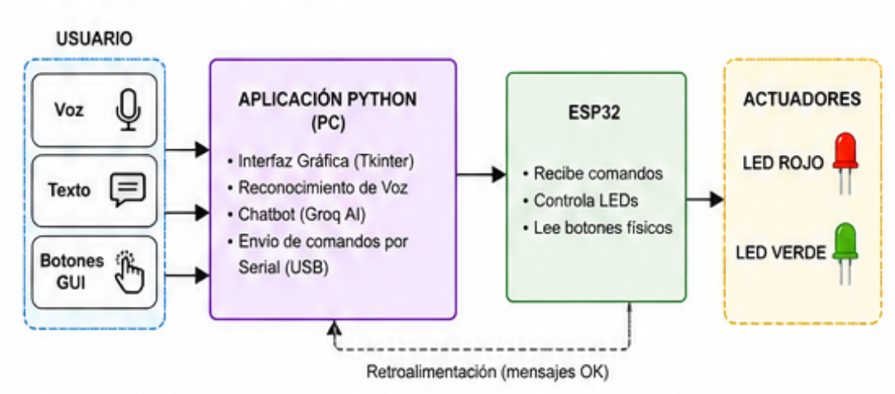

<strong>Integrantes:</strong>

<ul>
    <li>Jeicob David Pinilla Ruiz</li>
    <li>Fabian Abril Casallas</li>
</ul>

<h1><b>SISTEMA DE DIBUJO 3D CON BRAZO ROBÓTICO</b></h1>

Sistema de dibujo 3D que integra un brazo robótico controlado mediante una ESP32
con una simulación virtual desarrollada en PyBullet. El sistema permite ingresar
un número mediante un teclado físico conectado a la ESP32 y posteriormente
enviar esta información a un computador mediante comunicación serial.

<h2><b>Requisito especial: Python 3.11</b></h2>

Para realizar la simulación en la computadora fue necesario utilizar
<strong>Python 3.11</strong>. Esta versión permite trabajar de manera estable
con las librerías utilizadas en el proyecto, especialmente PyBullet y PySerial.

<pre><code># Creación y activación del entorno virtual en Windows

python3.11 -m venv venv
venv\Scripts\activate

# Instalación de las librerías necesarias

pip install pybullet pyserial
</code></pre>

<h2><b>¿Cómo funciona el sistema?</b></h2>

<h3><b>1. Captura de datos mediante MicroPython</b></h3>

La placa ESP32 lee constantemente el teclado físico. Cuando se presiona un
botón, el programa aplica un filtro antirrebote para evitar lecturas duplicadas.
Posteriormente, muestra la tecla presionada en la pantalla LCD y envía el número
a la computadora mediante el cable USB.

<h3><b>2. Recepción de datos en el computador</b></h3>

Un programa desarrollado en Python permanece escuchando el puerto USB de la
ESP32. Cuando recibe un número válido entre 0 y 9, interpreta la información
y activa la orden correspondiente para comenzar el dibujo en el entorno virtual.

<h3><b>3. Generación de la forma</b></h3>

El programa contiene las instrucciones geométricas necesarias para representar
cada número. Los puntos correspondientes a la figura son ajustados al tamaño
adecuado y posteriormente rotados para que el número quede orientado
correctamente respecto a la cámara del simulador.

<h3><b>4. Movimiento del brazo y dibujo 3D</b></h3>

El motor de simulación calcula las posiciones necesarias de las articulaciones
del brazo para alcanzar cada punto mediante cinemática inversa. A medida que
la punta del brazo se desplaza, se genera un rastro que representa el dibujo.
Cuando el número contiene partes separadas, como ocurre con algunos trazos del
número 4, el brazo levanta el lápiz antes de desplazarse hacia la siguiente
posición.

<h2><b>Diagrama de bloques</b></h2>

    <!-- Colocar aquí la imagen del diagrama de bloques -->
    

<h2><b>Evidencia fotográfica</b></h2>

A continuación se puede colocar la evidencia del montaje físico de la ESP32,
el teclado, la pantalla LCD y la simulación realizada en PyBullet.

    <!-- Colocar aquí la fotografía del montaje o captura de PyBullet -->
    

<h2><b>Video de funcionamiento</b></h2>

En el siguiente enlace se puede observar el funcionamiento del sistema,
incluyendo la comunicación entre la ESP32, el computador y la simulación
realizada mediante PyBullet.

    <a href="https://youtu.be/EHqepvXtMkA" target="_blank">
        <b>Ver video de funcionamiento en YouTube</b>
    </a>

