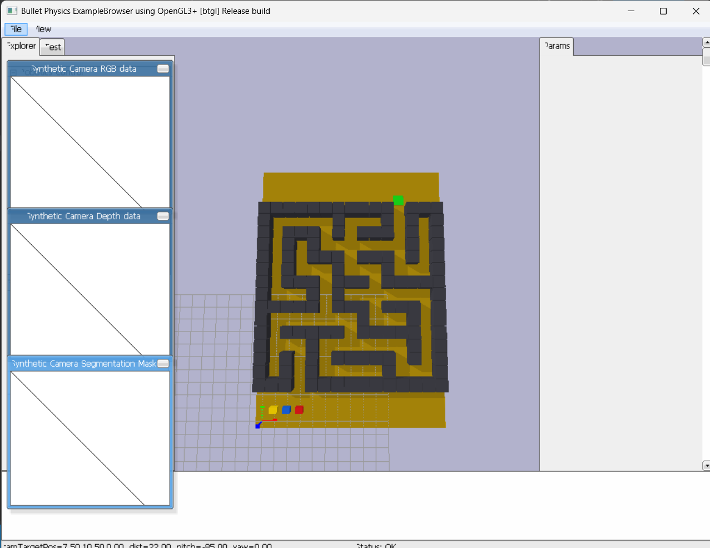

<strong>Integrantes:</strong>

<ul>
    <li>Jeicob David Pinilla Ruiz</li>
    <li>Fabian Abril Casallas</li>
</ul>

    <h1 align="center"><b>NAVEGACIÓN CON FEROMONAS POR RED</b></h1>

    <b>ESP32 + Wi-Fi + UDP + PyBullet</b>

En este proyecto se utilizan tres carritos controlados mediante ESP32 para simular
el comportamiento de hormigas que buscan la salida de un laberinto.
Cada carrito utiliza un algoritmo basado en feromonas para seleccionar su
siguiente movimiento.

Mientras los carritos se desplazan por el laberinto, depositan feromonas en las
posiciones visitadas. Estas feromonas son intercambiadas mediante una red Wi-Fi
utilizando comunicación UDP.

Un computador central recibe las coordenadas de los tres ESP32, actualiza sus
posiciones y representa los carritos en tiempo real mediante PyBullet.
Además, el computador retransmite las feromonas recibidas hacia los demás
carritos para permitir el intercambio de información entre ellos.

<h2><b>Diagrama de bloques</b></h2>

    

<h2><b>Funcionamiento</b></h2>

El sistema está compuesto por tres ESP32 que representan los carritos
autónomos y un computador que funciona como servidor central.

Cada ESP32 conoce el mapa del laberinto y su posición inicial. En cada paso,
analiza las posiciones vecinas disponibles y calcula una probabilidad de
movimiento utilizando dos factores principales: la cantidad de feromona
presente en cada posición y la distancia hasta la meta.

Cuando un carrito se desplaza, deposita una cantidad de feromona en la nueva
posición y envía al computador sus coordenadas mediante UDP.

El computador recibe esta información y actualiza la representación del
carrito correspondiente en PyBullet. Posteriormente, la feromona depositada
se envía a los demás ESP32 para que puedan utilizarla durante su navegación.

    

En la simulación, cada carrito tiene un color diferente para facilitar su
identificación:

<ul>
    <li><strong>ESP32_1:</strong> Carro amarillo.</li>
    <li><strong>ESP32_2:</strong> Carro azul.</li>
    <li><strong>ESP32_3:</strong> Carro verde.</li>
</ul>

La meta se encuentra en la coordenada <strong>(7, 1)</strong> del laberinto.
Los tres carritos comienzan en diferentes posiciones y avanzan utilizando la
información de las feromonas compartidas.

<h2><b>Video del funcionamiento</b></h2>

En el siguiente video se puede observar el funcionamiento del sistema,
incluyendo el movimiento de los tres carritos, la comunicación mediante
Wi-Fi y la visualización del gemelo digital en PyBullet.

    <!-- Reemplazar el enlace por el video real -->
    <a href="https://youtu.be/HMbSgn6qK1o" target="_blank">
        <b>Ver video del funcionamiento en YouTube</b>
    </a>

<h2><b>1. Código del servidor PC - Python + PyBullet</b></h2>

Este programa se ejecuta en el computador y funciona como servidor central del
sistema. Utiliza comunicación UDP para recibir las posiciones de los ESP32 y
retransmitir la información de las feromonas.

También crea el gemelo digital del laberinto utilizando PyBullet y representa
cada ESP32 mediante un cuerpo de diferente color.

<pre>
<code>

# PC - Gemelo Digital PyBullet e Intercambio de Feromonas con Control de Llegadas
import socket
import json
import threading
import time
import pybullet as p
import pybullet_data

PORT = 5005

W, H = 15, 21
GRID = [
    [0, 0, 0, 0, 0, 0, 0, 0, 0, 0, 0, 0, 0, 0, 0],
    [0, 0, 0, 0, 0, 0, 0, 0, 0, 0, 0, 0, 0, 0, 0],
    [0, 0, 0, 0, 0, 0, 0, 0, 0, 0, 0, 0, 0, 0, 0],
    [1, 1, 1, 1, 1, 1, 1, 1, 1, 1, 1, 0, 1, 1, 1],
    [1, 0, 0, 0, 0, 0, 1, 0, 0, 0, 1, 0, 1, 0, 1],
    [1, 0, 1, 1, 1, 0, 1, 0, 1, 1, 1, 0, 1, 0, 1],
    [1, 0, 1, 0, 1, 0, 0, 0, 0, 0, 0, 0, 1, 0, 1],
    [1, 0, 1, 0, 1, 1, 1, 0, 1, 1, 1, 0, 1, 0, 1],
    [1, 0, 1, 0, 0, 0, 1, 0, 0, 0, 1, 0, 0, 0, 1],
    [1, 0, 1, 1, 1, 0, 1, 1, 1, 0, 1, 1, 1, 1, 1],
    [1, 0, 0, 0, 1, 0, 1, 0, 0, 0, 0, 0, 0, 0, 1],
    [1, 1, 1, 1, 1, 0, 1, 1, 1, 0, 1, 1, 1, 0, 1],
    [1, 0, 0, 0, 0, 0, 0, 0, 1, 0, 0, 0, 1, 0, 1],
    [1, 0, 1, 1, 1, 1, 1, 0, 1, 1, 1, 1, 1, 0, 1],
    [1, 0, 0, 0, 1, 0, 0, 0, 0, 0, 0, 0, 1, 0, 1],
    [1, 0, 1, 0, 1, 0, 1, 1, 1, 1, 1, 0, 1, 0, 1],
    [1, 0, 1, 0, 1, 0, 0, 0, 0, 0, 1, 0, 0, 0, 1],
    [1, 1, 1, 0, 1, 1, 1, 1, 1, 1, 1, 1, 1, 1, 1],
    [0, 0, 0, 0, 0, 0, 0, 0, 0, 0, 0, 0, 0, 0, 0],
    [0, 0, 0, 0, 0, 0, 0, 0, 0, 0, 0, 0, 0, 0, 0],
    [0, 0, 0, 0, 0, 0, 0, 0, 0, 0, 0, 0, 0, 0, 0]
]

GOAL = (11, 2)

STARTS = {
    "ESP32_1": (1, 19),
    "ESP32_2": (2, 19),
    "ESP32_3": (3, 19)
}

robots = {
    "ESP32_1": {"x": STARTS["ESP32_1"][0], "y": STARTS["ESP32_1"][1]},
    "ESP32_2": {"x": STARTS["ESP32_2"][0], "y": STARTS["ESP32_2"][1]},
    "ESP32_3": {"x": STARTS["ESP32_3"][0], "y": STARTS["ESP32_3"][1]},
}

clientes_esp = set()
lock = threading.Lock()
llegadas = []
tiempo_inicio = time.time()

sock = socket.socket(socket.AF_INET, socket.SOCK_DGRAM)
sock.setsockopt(socket.SOL_SOCKET, socket.SO_REUSEADDR, 1)
sock.bind(("0.0.0.0", PORT))
sock.settimeout(0.2)

def servidor():
    global tiempo_inicio
    while True:
        try:
            datos, addr = sock.recvfrom(1024)
            clientes_esp.add(addr)
            msg = json.loads(datos.decode())
            rid = msg.get("id")
            
            if rid in robots:
                nx = int(msg.get("x", robots[rid]["x"]))
                ny = int(msg.get("y", robots[rid]["y"]))
                
                with lock:
                    robots[rid]["x"] = nx
                    robots[rid]["y"] = ny
                    
                    # Verificación de llegada a la meta
                    if (nx, ny) == GOAL and rid not in llegadas:
                        llegadas.append(rid)
                        t_llegada = round(time.time() - tiempo_inicio, 2)
                        puesto = len(llegadas)
                        print(f"\n ¡{rid} ha LLEGADO A LA META! Puesto #{puesto} (Tiempo: {t_llegada}s)")
                
                ph_dep = float(msg.get("ph_dep", 0.0))
                if ph_dep > 0:
                    paquete_update = json.dumps({
                        "cmd": "ph_update", "x": nx, "y": ny, "v": ph_dep
                    }).encode()
                    for cliente in clientes_esp:
                        if cliente != addr:
                            sock.sendto(paquete_update, cliente)
        except socket.timeout:
            pass
        except Exception:
            pass

def crear_caja(pos, half_extents, masa=0, color=(0.7,0.7,0.7,1)):
    col = p.createCollisionShape(p.GEOM_BOX, halfExtents=half_extents)
    vis = p.createVisualShape(p.GEOM_BOX, halfExtents=half_extents, rgbaColor=color)
    return p.createMultiBody(baseMass=masa, baseCollisionShapeIndex=col, baseVisualShapeIndex=vis, basePosition=pos)

def main():
    global tiempo_inicio
    threading.Thread(target=servidor, daemon=True).start()
    p.connect(p.GUI)
    p.setAdditionalSearchPath(pybullet_data.getDataPath())
    p.setGravity(0, 0, -9.81)
    
    p.resetDebugVisualizerCamera(cameraDistance=22, cameraYaw=0, cameraPitch=-85, cameraTargetPosition=[W/2, H/2, 0])

    plane_id = p.createCollisionShape(p.GEOM_BOX, halfExtents=[W/2, H/2, 0.05])
    p.createMultiBody(0, plane_id, -1, [W/2-0.5, H/2-0.5, -0.05])

    for y in range(H):
        for x in range(W):
            if GRID[y][x] == 1:
                crear_caja([x, H - 1 - y, 0.5], [0.48, 0.48, 0.5], 0, (0.25, 0.25, 0.28, 1))

    # Casilla Meta en (11, 2)
    crear_caja([GOAL[0], H - 1 - GOAL[1], 0.02], [0.42, 0.42, 0.02], 0, (0.1, 0.9, 0.1, 1))

    # Vehículos (ESP32_3 en ROJO)
    cuerpos = {
        "ESP32_1": crear_caja([STARTS["ESP32_1"][0], H - 1 - STARTS["ESP32_1"][1], 0.35], [0.3, 0.22, 0.2], 1.0, (1.0, 0.85, 0.0, 1.0)), # Amarillo
        "ESP32_2": crear_caja([STARTS["ESP32_2"][0], H - 1 - STARTS["ESP32_2"][1], 0.35], [0.3, 0.22, 0.2], 1.0, (0.1, 0.4, 0.9, 1.0)),  # Azul
        "ESP32_3": crear_caja([STARTS["ESP32_3"][0], H - 1 - STARTS["ESP32_3"][1], 0.35], [0.3, 0.22, 0.2], 1.0, (0.9, 0.1, 0.1, 1.0)),  # ROJO
    }

    tiempo_inicio = time.time()
    print("--- INICIANDO SIMULACIÓN DE CARRERA Y NAVEGACIÓN ---")

    while p.isConnected():
        with lock:
            datos = {rid: dict(v) for rid, v in robots.items()}
        for rid, info in datos.items():
            p.resetBasePositionAndOrientation(cuerpos[rid], [info["x"], H - 1 - info["y"], 0.35], [0, 0, 0, 1])
        p.stepSimulation()
        time.sleep(1/60)

if __name__ == "__main__":
    main()
    
</code>
</pre>

<h2><b>2. Código MicroPython - ESP32_1 - Carro Amarillo</b></h2>

Este programa corresponde al primer carrito. La ESP32 se conecta a la red
Wi-Fi, se comunica con el computador mediante UDP y utiliza el algoritmo de
selección basado en feromonas para decidir su siguiente posición.

El carro amarillo comienza en la coordenada <strong>(1, 11)</strong> y tiene
como objetivo llegar a la posición <strong>(7, 1)</strong>.

<pre>
<code>

import network, socket, time, json, random

SSID = "TVC_FAMILIAABRIL"
PASSWORD = "SeA1ft81oD"
PC_IP = "192.168.1.2"
PC_PORT = 5005

ROBOT_ID = "ESP32_1"
W, H = 15, 21
GRID = [
    [0, 0, 0, 0, 0, 0, 0, 0, 0, 0, 0, 0, 0, 0, 0],
    [0, 0, 0, 0, 0, 0, 0, 0, 0, 0, 0, 0, 0, 0, 0],
    [0, 0, 0, 0, 0, 0, 0, 0, 0, 0, 0, 0, 0, 0, 0],
    [1, 1, 1, 1, 1, 1, 1, 1, 1, 1, 1, 0, 1, 1, 1],
    [1, 0, 0, 0, 0, 0, 1, 0, 0, 0, 1, 0, 1, 0, 1],
    [1, 0, 1, 1, 1, 0, 1, 0, 1, 1, 1, 0, 1, 0, 1],
    [1, 0, 1, 0, 1, 0, 0, 0, 0, 0, 0, 0, 1, 0, 1],
    [1, 0, 1, 0, 1, 1, 1, 0, 1, 1, 1, 0, 1, 0, 1],
    [1, 0, 1, 0, 0, 0, 1, 0, 0, 0, 1, 0, 0, 0, 1],
    [1, 0, 1, 1, 1, 0, 1, 1, 1, 0, 1, 1, 1, 1, 1],
    [1, 0, 0, 0, 1, 0, 1, 0, 0, 0, 0, 0, 0, 0, 1],
    [1, 1, 1, 1, 1, 0, 1, 1, 1, 0, 1, 1, 1, 0, 1],
    [1, 0, 0, 0, 0, 0, 0, 0, 1, 0, 0, 0, 1, 0, 1],
    [1, 0, 1, 1, 1, 1, 1, 0, 1, 1, 1, 1, 1, 0, 1],
    [1, 0, 0, 0, 1, 0, 0, 0, 0, 0, 0, 0, 1, 0, 1],
    [1, 0, 1, 0, 1, 0, 1, 1, 1, 1, 1, 0, 1, 0, 1],
    [1, 0, 1, 0, 1, 0, 0, 0, 0, 0, 1, 0, 0, 0, 1],
    [1, 1, 1, 0, 1, 1, 1, 1, 1, 1, 1, 1, 1, 1, 1],
    [0, 0, 0, 0, 0, 0, 0, 0, 0, 0, 0, 0, 0, 0, 0],
    [0, 0, 0, 0, 0, 0, 0, 0, 0, 0, 0, 0, 0, 0, 0],
    [0, 0, 0, 0, 0, 0, 0, 0, 0, 0, 0, 0, 0, 0, 0]
]
GOAL = (11, 2)
x, y = 1, 19

pheromone = {(c, r): 1.0 for r in range(H) for c in range(W) if GRID[r][c] == 0}
memoria_camino = set([(x, y)]) # Recuerda por dónde ha pasado para no hacer bucles pequeños
pila_retorno = [] # Le sirve para dar reversa si entra a un callejón sin salida

wlan = network.WLAN(network.STA_IF)
wlan.active(True)
wlan.connect(SSID, PASSWORD)
while not wlan.isconnected(): time.sleep(0.5)

sock = socket.socket(socket.AF_INET, socket.SOCK_DGRAM)
sock.setblocking(False)

def paso_hormiga_local(cx, cy):
    vecinos_validos = []
    # Mirar solo almas inmediatas: Arriba, Abajo, Izq, Der
    for dx, dy in [(1,0), (-1,0), (0,1), (0,-1)]:
        nx, ny = cx + dx, cy + dy
        if 0 <= nx < W and 0 <= ny < H and GRID[ny][nx] == 0:
            if (nx, ny) not in memoria_camino: # No devolvernos inmediatamente
                vecinos_validos.append((nx, ny))
    
    if vecinos_validos:
        # Exploración de hormiga: Tomar decisión probabilística basada en olores
        pesos = []
        for nx, ny in vecinos_validos:
            nivel_feromona = pheromone.get((nx, ny), 1.0)
            dist_meta = abs(nx - GOAL[0]) + abs(ny - GOAL[1])
            atraccion = 10.0 / (dist_meta + 1)
            peso = (nivel_feromona ** 2) * atraccion # Ecuación clásica de ACO
            pesos.append(peso)
        
        # Ruleta probabilística
        suma_pesos = sum(pesos)
        rnd = random.random() * suma_pesos
        acumulado = 0
        for i, (nx, ny) in enumerate(vecinos_validos):
            acumulado += pesos[i]
            if acumulado >= rnd:
                pila_retorno.append((cx, cy))
                memoria_camino.add((nx, ny))
                return nx, ny, True # True = Está avanzando y explorando
        # Por seguridad de redondeo matemático
        nx, ny = vecinos_validos[-1]
        pila_retorno.append((cx, cy))
        memoria_camino.add((nx, ny))
        return nx, ny, True
    else:
        # ¡CALLEJÓN SIN SALIDA! - Retroceder sobre sus propios pasos
        if len(pila_retorno) > 0:
            px, py = pila_retorno.pop()
            return px, py, False # False = Retrocediendo
        return cx, cy, False

ultimo_movimiento = time.ticks_ms()
ultima_evaporacion = time.ticks_ms()

while True:
    # Oler feromonas de otros
    try:
        data, _ = sock.recvfrom(512)
        msg = json.loads(data.decode())
        if msg.get("cmd") == "ph_update":
            pos_p = (msg["x"], msg["y"])
            pheromone[pos_p] = pheromone.get(pos_p, 1.0) + msg["v"]
    except: pass

    # Evaporación natural de la colonia
    if time.ticks_diff(time.ticks_ms(), ultima_evaporacion) > 2000:
        for k in pheromone:
            if pheromone[k] > 1.0:
                pheromone[k] = max(1.0, pheromone[k] * 0.95)
        ultima_evaporacion = time.ticks_ms()

    # Movimiento físico paso a paso
    if time.ticks_diff(time.ticks_ms(), ultimo_movimiento) > 500:
        if (x, y) != GOAL:
            x, y, avanzando = paso_hormiga_local(x, y)
            
            if avanzando:
                # Si está descubriendo camino, deposita feromona fuerte
                deposito = 2.0
                pheromone[(x, y)] = pheromone.get((x, y), 1.0) + deposito
                sock.sendto(json.dumps({"id": ROBOT_ID, "x": x, "y": y, "ph_dep": deposito}).encode(), (PC_IP, PC_PORT))
            else:
                # Si está retrocediendo de un callejón, NO deposita feromona (para que otros no entren ahí)
                sock.sendto(json.dumps({"id": ROBOT_ID, "x": x, "y": y, "ph_dep": 0.0}).encode(), (PC_IP, PC_PORT))
            
            if (x, y) == GOAL:
                print("¡Llegué a la meta explorando!")
        ultimo_movimiento = time.ticks_ms()
    
    time.sleep_ms(30)
    
</code>
</pre>

<h2><b>3. Código MicroPython - ESP32_2 - Carro Azul</b></h2>

Este programa corresponde al segundo carrito. Su funcionamiento es equivalente
al del ESP32_1, pero utiliza el identificador <strong>ESP32_2</strong> y comienza
en una posición diferente del laberinto.

El carro azul comienza en la coordenada <strong>(5, 11)</strong>. Recibe las
feromonas enviadas por el computador y las utiliza para modificar las
probabilidades de selección de sus siguientes movimientos.

<pre>
<code>

import network, socket, time, json, random

SSID = "TVC_FAMILIAABRIL"
PASSWORD = "SeA1ft81oD"
PC_IP = "192.168.1.2"
PC_PORT = 5005

ROBOT_ID = "ESP32_2"
W, H = 15, 21
GRID = [
    [0, 0, 0, 0, 0, 0, 0, 0, 0, 0, 0, 0, 0, 0, 0],
    [0, 0, 0, 0, 0, 0, 0, 0, 0, 0, 0, 0, 0, 0, 0],
    [0, 0, 0, 0, 0, 0, 0, 0, 0, 0, 0, 0, 0, 0, 0],
    [1, 1, 1, 1, 1, 1, 1, 1, 1, 1, 1, 0, 1, 1, 1],
    [1, 0, 0, 0, 0, 0, 1, 0, 0, 0, 1, 0, 1, 0, 1],
    [1, 0, 1, 1, 1, 0, 1, 0, 1, 1, 1, 0, 1, 0, 1],
    [1, 0, 1, 0, 1, 0, 0, 0, 0, 0, 0, 0, 1, 0, 1],
    [1, 0, 1, 0, 1, 1, 1, 0, 1, 1, 1, 0, 1, 0, 1],
    [1, 0, 1, 0, 0, 0, 1, 0, 0, 0, 1, 0, 0, 0, 1],
    [1, 0, 1, 1, 1, 0, 1, 1, 1, 0, 1, 1, 1, 1, 1],
    [1, 0, 0, 0, 1, 0, 1, 0, 0, 0, 0, 0, 0, 0, 1],
    [1, 1, 1, 1, 1, 0, 1, 1, 1, 0, 1, 1, 1, 0, 1],
    [1, 0, 0, 0, 0, 0, 0, 0, 1, 0, 0, 0, 1, 0, 1],
    [1, 0, 1, 1, 1, 1, 1, 0, 1, 1, 1, 1, 1, 0, 1],
    [1, 0, 0, 0, 1, 0, 0, 0, 0, 0, 0, 0, 1, 0, 1],
    [1, 0, 1, 0, 1, 0, 1, 1, 1, 1, 1, 0, 1, 0, 1],
    [1, 0, 1, 0, 1, 0, 0, 0, 0, 0, 1, 0, 0, 0, 1],
    [1, 1, 1, 0, 1, 1, 1, 1, 1, 1, 1, 1, 1, 1, 1],
    [0, 0, 0, 0, 0, 0, 0, 0, 0, 0, 0, 0, 0, 0, 0],
    [0, 0, 0, 0, 0, 0, 0, 0, 0, 0, 0, 0, 0, 0, 0],
    [0, 0, 0, 0, 0, 0, 0, 0, 0, 0, 0, 0, 0, 0, 0]
]
GOAL = (11, 2)
x, y = 2, 19

pheromone = {(c, r): 1.0 for r in range(H) for c in range(W) if GRID[r][c] == 0}
memoria_camino = set([(x, y)])
pila_retorno = []

wlan = network.WLAN(network.STA_IF)
wlan.active(True)
wlan.connect(SSID, PASSWORD)
while not wlan.isconnected(): time.sleep(0.5)

sock = socket.socket(socket.AF_INET, socket.SOCK_DGRAM)
sock.setblocking(False)

def paso_hormiga_local(cx, cy):
    vecinos_validos = []
    for dx, dy in [(1,0), (-1,0), (0,1), (0,-1)]:
        nx, ny = cx + dx, cy + dy
        if 0 <= nx < W and 0 <= ny < H and GRID[ny][nx] == 0:
            if (nx, ny) not in memoria_camino:
                vecinos_validos.append((nx, ny))
    
    if vecinos_validos:
        pesos = []
        for nx, ny in vecinos_validos:
            nivel_feromona = pheromone.get((nx, ny), 1.0)
            dist_meta = abs(nx - GOAL[0]) + abs(ny - GOAL[1])
            atraccion = 10.0 / (dist_meta + 1)
            peso = (nivel_feromona ** 2) * atraccion
            pesos.append(peso)
        
        suma_pesos = sum(pesos)
        rnd = random.random() * suma_pesos
        acumulado = 0
        for i, (nx, ny) in enumerate(vecinos_validos):
            acumulado += pesos[i]
            if acumulado >= rnd:
                pila_retorno.append((cx, cy))
                memoria_camino.add((nx, ny))
                return nx, ny, True
        nx, ny = vecinos_validos[-1]
        pila_retorno.append((cx, cy))
        memoria_camino.add((nx, ny))
        return nx, ny, True
    else:
        if len(pila_retorno) > 0:
            px, py = pila_retorno.pop()
            return px, py, False
        return cx, cy, False

ultimo_movimiento = time.ticks_ms()
ultima_evaporacion = time.ticks_ms()

while True:
    try:
        data, _ = sock.recvfrom(512)
        msg = json.loads(data.decode())
        if msg.get("cmd") == "ph_update":
            pos_p = (msg["x"], msg["y"])
            pheromone[pos_p] = pheromone.get(pos_p, 1.0) + msg["v"]
    except: pass

    if time.ticks_diff(time.ticks_ms(), ultima_evaporacion) > 2000:
        for k in pheromone:
            if pheromone[k] > 1.0:
                pheromone[k] = max(1.0, pheromone[k] * 0.95)
        ultima_evaporacion = time.ticks_ms()

    if time.ticks_diff(time.ticks_ms(), ultimo_movimiento) > 500:
        if (x, y) != GOAL:
            x, y, avanzando = paso_hormiga_local(x, y)
            
            if avanzando:
                deposito = 2.0
                pheromone[(x, y)] = pheromone.get((x, y), 1.0) + deposito
                sock.sendto(json.dumps({"id": ROBOT_ID, "x": x, "y": y, "ph_dep": deposito}).encode(), (PC_IP, PC_PORT))
            else:
                sock.sendto(json.dumps({"id": ROBOT_ID, "x": x, "y": y, "ph_dep": 0.0}).encode(), (PC_IP, PC_PORT))
            
            if (x, y) == GOAL:
                print("¡Llegué a la meta explorando!")
        ultimo_movimiento = time.ticks_ms()
    
    time.sleep_ms(30)
    
</code>
</pre>

<h2><b>4. Código MicroPython - ESP32_3 - Carro Verde</b></h2>

Este programa corresponde al tercer carrito del sistema. Utiliza la misma
lógica de navegación y comunicación que los otros dos ESP32, pero tiene el
identificador <strong>ESP32_3</strong> y una posición inicial diferente.

El carro verde comienza en la coordenada <strong>(9, 11)</strong> y comparte
la información de feromonas con los otros carritos mediante el computador
central.

<pre>
<code>

import network, socket, time, json, random

SSID = "TVC_FAMILIAABRIL"
PASSWORD = "SeA1ft81oD"
PC_IP = "192.168.1.2"
PC_PORT = 5005

ROBOT_ID = "ESP32_3"
W, H = 15, 21
GRID = [
    [0, 0, 0, 0, 0, 0, 0, 0, 0, 0, 0, 0, 0, 0, 0],
    [0, 0, 0, 0, 0, 0, 0, 0, 0, 0, 0, 0, 0, 0, 0],
    [0, 0, 0, 0, 0, 0, 0, 0, 0, 0, 0, 0, 0, 0, 0],
    [1, 1, 1, 1, 1, 1, 1, 1, 1, 1, 1, 0, 1, 1, 1],
    [1, 0, 0, 0, 0, 0, 1, 0, 0, 0, 1, 0, 1, 0, 1],
    [1, 0, 1, 1, 1, 0, 1, 0, 1, 1, 1, 0, 1, 0, 1],
    [1, 0, 1, 0, 1, 0, 0, 0, 0, 0, 0, 0, 1, 0, 1],
    [1, 0, 1, 0, 1, 1, 1, 0, 1, 1, 1, 0, 1, 0, 1],
    [1, 0, 1, 0, 0, 0, 1, 0, 0, 0, 1, 0, 0, 0, 1],
    [1, 0, 1, 1, 1, 0, 1, 1, 1, 0, 1, 1, 1, 1, 1],
    [1, 0, 0, 0, 1, 0, 1, 0, 0, 0, 0, 0, 0, 0, 1],
    [1, 1, 1, 1, 1, 0, 1, 1, 1, 0, 1, 1, 1, 0, 1],
    [1, 0, 0, 0, 0, 0, 0, 0, 1, 0, 0, 0, 1, 0, 1],
    [1, 0, 1, 1, 1, 1, 1, 0, 1, 1, 1, 1, 1, 0, 1],
    [1, 0, 0, 0, 1, 0, 0, 0, 0, 0, 0, 0, 1, 0, 1],
    [1, 0, 1, 0, 1, 0, 1, 1, 1, 1, 1, 0, 1, 0, 1],
    [1, 0, 1, 0, 1, 0, 0, 0, 0, 0, 1, 0, 0, 0, 1],
    [1, 1, 1, 0, 1, 1, 1, 1, 1, 1, 1, 1, 1, 1, 1],
    [0, 0, 0, 0, 0, 0, 0, 0, 0, 0, 0, 0, 0, 0, 0],
    [0, 0, 0, 0, 0, 0, 0, 0, 0, 0, 0, 0, 0, 0, 0],
    [0, 0, 0, 0, 0, 0, 0, 0, 0, 0, 0, 0, 0, 0, 0]
]
GOAL = (11, 2)
x, y = 3, 19

pheromone = {(c, r): 1.0 for r in range(H) for c in range(W) if GRID[r][c] == 0}
memoria_camino = set([(x, y)])
pila_retorno = []

wlan = network.WLAN(network.STA_IF)
wlan.active(True)
wlan.connect(SSID, PASSWORD)
while not wlan.isconnected(): time.sleep(0.5)

sock = socket.socket(socket.AF_INET, socket.SOCK_DGRAM)
sock.setblocking(False)

def paso_hormiga_local(cx, cy):
    vecinos_validos = []
    for dx, dy in [(1,0), (-1,0), (0,1), (0,-1)]:
        nx, ny = cx + dx, cy + dy
        if 0 <= nx < W and 0 <= ny < H and GRID[ny][nx] == 0:
            if (nx, ny) not in memoria_camino:
                vecinos_validos.append((nx, ny))
    
    if vecinos_validos:
        pesos = []
        for nx, ny in vecinos_validos:
            nivel_feromona = pheromone.get((nx, ny), 1.0)
            dist_meta = abs(nx - GOAL[0]) + abs(ny - GOAL[1])
            atraccion = 10.0 / (dist_meta + 1)
            peso = (nivel_feromona ** 2) * atraccion
            pesos.append(peso)
        
        suma_pesos = sum(pesos)
        rnd = random.random() * suma_pesos
        acumulado = 0
        for i, (nx, ny) in enumerate(vecinos_validos):
            acumulado += pesos[i]
            if acumulado >= rnd:
                pila_retorno.append((cx, cy))
                memoria_camino.add((nx, ny))
                return nx, ny, True
        nx, ny = vecinos_validos[-1]
        pila_retorno.append((cx, cy))
        memoria_camino.add((nx, ny))
        return nx, ny, True
    else:
        if len(pila_retorno) > 0:
            px, py = pila_retorno.pop()
            return px, py, False
        return cx, cy, False

ultimo_movimiento = time.ticks_ms()
ultima_evaporacion = time.ticks_ms()

while True:
    try:
        data, _ = sock.recvfrom(512)
        msg = json.loads(data.decode())
        if msg.get("cmd") == "ph_update":
            pos_p = (msg["x"], msg["y"])
            pheromone[pos_p] = pheromone.get(pos_p, 1.0) + msg["v"]
    except: pass

    if time.ticks_diff(time.ticks_ms(), ultima_evaporacion) > 2000:
        for k in pheromone:
            if pheromone[k] > 1.0:
                pheromone[k] = max(1.0, pheromone[k] * 0.95)
        ultima_evaporacion = time.ticks_ms()

    if time.ticks_diff(time.ticks_ms(), ultimo_movimiento) > 500:
        if (x, y) != GOAL:
            x, y, avanzando = paso_hormiga_local(x, y)
            
            if avanzando:
                deposito = 2.0
                pheromone[(x, y)] = pheromone.get((x, y), 1.0) + deposito
                sock.sendto(json.dumps({"id": ROBOT_ID, "x": x, "y": y, "ph_dep": deposito}).encode(), (PC_IP, PC_PORT))
            else:
                sock.sendto(json.dumps({"id": ROBOT_ID, "x": x, "y": y, "ph_dep": 0.0}).encode(), (PC_IP, PC_PORT))
            
            if (x, y) == GOAL:
                print("¡Llegué a la meta explorando!")
        ultimo_movimiento = time.ticks_ms()
    
    time.sleep_ms(30)
    
</code>
</pre>

<h2><b>5. Algoritmo de navegación por feromonas</b></h2>

Para seleccionar el siguiente movimiento se consideran las posiciones vecinas
que están libres dentro del laberinto. A cada posición se le asigna un peso
dependiendo de la cantidad de feromona y de su distancia hasta la meta.

La ecuación utilizada para calcular el peso de cada posición es:

    <b>
        P = &tau;1.2 &times; &eta;3.0
    </b>

donde <strong>&tau;</strong> representa la cantidad de feromona almacenada en
la posición y <strong>&eta;</strong> corresponde a la función heurística basada
en la distancia Manhattan hasta la meta.

La heurística utilizada es:

    <b>
        &eta; = 1 / (1 + |x - xmeta| + |y - ymeta|)
    </b>

Después de calcular los pesos, se realiza una selección probabilística del
siguiente movimiento. De esta forma, los carritos pueden utilizar la
información dejada previamente por otros carritos y continuar explorando el
laberinto.

<h2><b>6. Comunicación entre ESP32 y computador</b></h2>

La comunicación se realiza mediante paquetes UDP enviados a través de la red
Wi-Fi. Cada paquete enviado desde una ESP32 contiene el identificador del
carrito, sus coordenadas actuales y la cantidad de feromona depositada.

<pre>
<code>
paquete = {
    "id": ROBOT_ID,
    "x": x,
    "y": y,
    "ph_dep": deposito
}
</code>
</pre>

El computador recibe estos datos en el puerto <strong>5005</strong>. Después
de recibir una feromona, genera un mensaje con el comando
<strong>ph_update</strong> y lo envía a los demás ESP32 conectados.

<pre>
<code>
{
    "cmd": "ph_update",
    "x": x,
    "y": y,
    "v": ph_dep
}
</code>
</pre>

<h2><b>7. Gemelo digital en PyBullet</b></h2>

El computador funciona como un gemelo digital del sistema físico. Las
coordenadas recibidas desde los ESP32 se utilizan para actualizar en tiempo
real la posición de los tres carritos dentro del entorno virtual.

El laberinto está construido a partir de una matriz de 13 &times; 13,
donde el valor <strong>1</strong> representa una pared y el valor
<strong>0</strong> representa una posición libre para el movimiento.

Los tres carritos son representados mediante cuerpos 3D con diferentes
colores, permitiendo observar simultáneamente el movimiento de los robots
físicos y su representación virtual.

<h2><b>8. Distribución de los carritos</b></h2>

<table border="1" cellpadding="8" cellspacing="0" align="center">
    <tr>
        <th>Robot</th>
        <th>Color</th>
        <th>Posición inicial</th>
        <th>Meta</th>
    </tr>

    <tr>
        <td>ESP32_1</td>
        <td>Amarillo</td>
        <td>(1, 11)</td>
        <td>(7, 1)</td>
    </tr>

    <tr>
        <td>ESP32_2</td>
        <td>Azul</td>
        <td>(5, 11)</td>
        <td>(7, 1)</td>
    </tr>

    <tr>
        <td>ESP32_3</td>
        <td>Verde</td>
        <td>(9, 11)</td>
        <td>(7, 1)</td>
    </tr>
</table>

