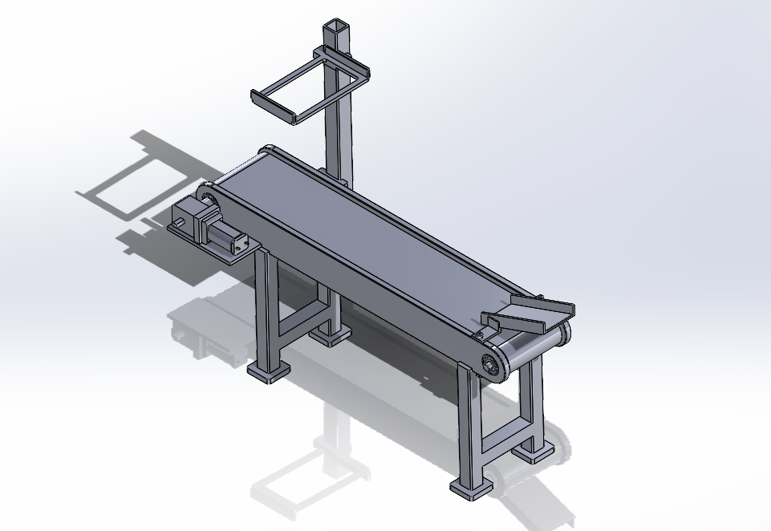
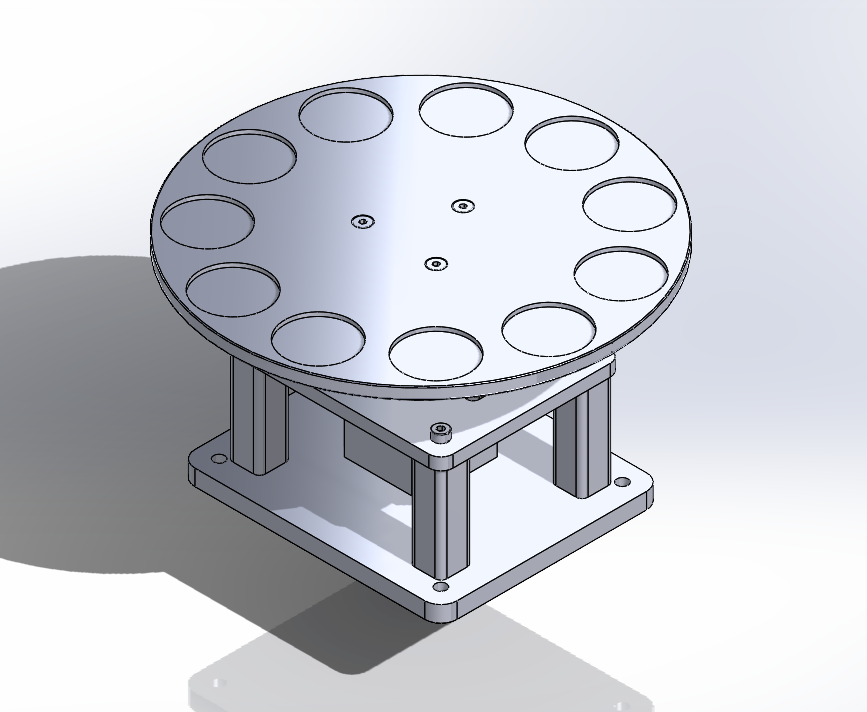
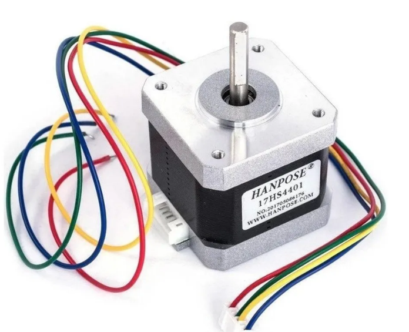
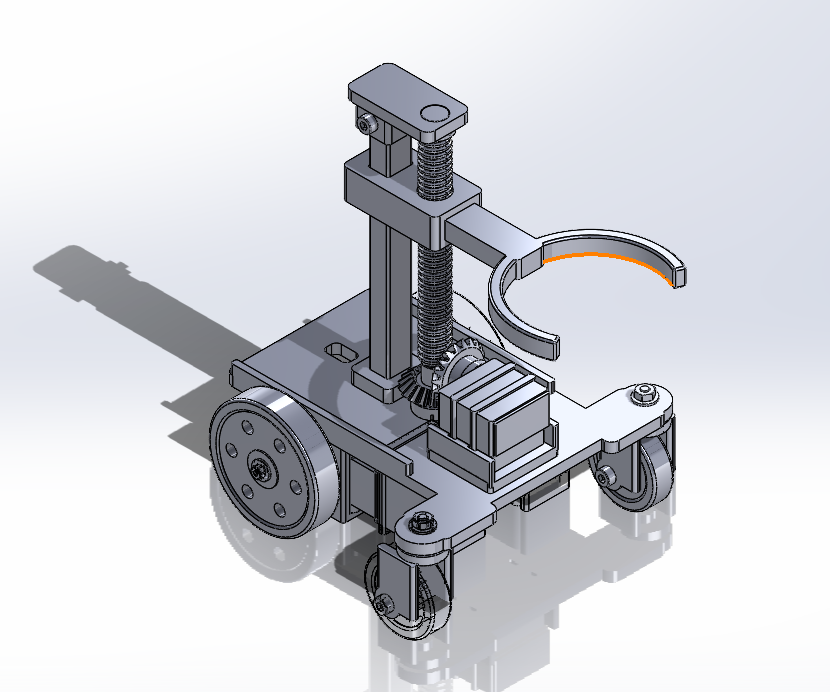
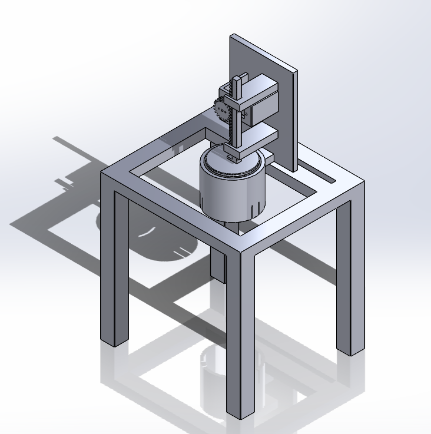
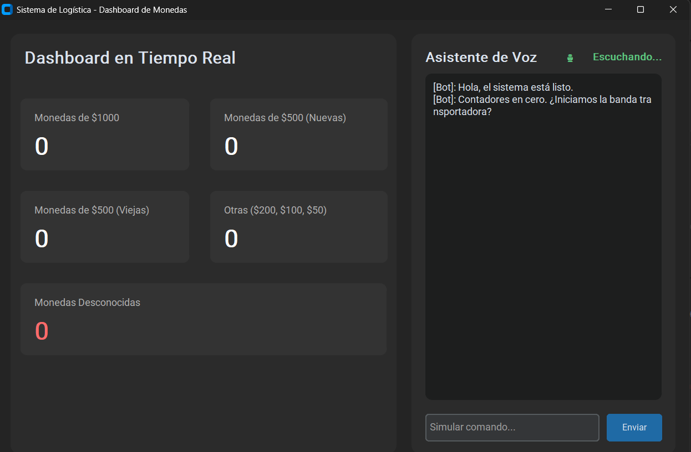

<strong>Integrantes:</strong>

<ul>
    <li>Jeicob David Pinilla Ruiz</li>
    <li>Fabian Abril Casallas</li>
</ul>

    <h1 align="center"><b>Segundo Parcial</b></h1>

    Clasificación de monedas mediante visión artificial (YOLO), con ESP32 e interfaz de monitoreo en Python.

<h2><b>Funcionamiento</b></h2>

Las monedas son depositadas a través de una rampa hacia una banda transportadora
manipulada por un motoreductor. A medida que avanza cada moneda, la cámara de un
smartphone posicionada en un soporte especializado captura su imagen para procesarla
con el modelo YOLO. Posteriormente, la moneda es guiada hacia un disco selector
rotativo impulsado por un motor paso a paso, el cual posiciona de manera precisa uno
de los 10 vasos receptores.

Una vez que un vaso se llena, un carro robótico con garra accionado por un servomotor
MG90S lo retira y lo traslada hacia la estación de tapado, donde un mecanismo de
piñón y cremallera coloca la tapa para completar el empaquetado.

<h2><b>1. Banda Transportadora y Soporte de Cámara </b></h2>

La primera etapa consiste en una rampa de entrada por la cual se depositan las
monedas hacia la banda transportadora. La banda es impulsada por un motoreductor
acoplado a una etapa de potencia y controlado mediante la tarjeta ESP32.
Sobre la estructura se integra un soporte para smartphone diseñado para mantener
la cámara centrada sobre el flujo de monedas.

Para la identificación de las monedas se está entrenando un modelo de detección
de objetos con YOLO. Actualmente, el dataset cuenta con 30 imágenes por tipo de
moneda. Sin embargo, debido a las variaciones de iluminación y sombras sobre la
superficie de las monedas, se requiere continuar con la recolección de muestras
para incrementar la precisión del modelo.

    

<h2><b>2. Disco Selector de Vasos y Motor Paso a Paso </b></h2>

Una vez clasificada la moneda, esta cae dentro de uno de los recipientes
colocados en el disco selector. El disco cuenta con 10 espacios diseñados
para alojar los vasos donde se almacenarán las monedas según su denominación.

Para garantizar el alineamiento exacto debajo del punto de caída de la moneda,
el disco es impulsado por un motor paso a paso NEMA 17. La ESP32 calcula con
precisión el ángulo de giro necesario para ubicar el vaso correspondiente
en la posición correcta.

    

    

<h2><b>3. Carro de Transporte con Garra Robótica </b></h2>

Cuando un vaso alcanza la cantidad requerida de monedas, entra en acción el
sistema de transporte. Este consiste en un carro móvil equipado con una garra
de sujeción accionada por un servomotor MG90S.

El giro del servomotor permite abrir y cerrar la garra de manera firme sobre
el vaso lleno, permitiendo retirarlo de la estación de selección y desplazarlo
hacia el área de sellado.

    

<h2><b>4. Sistema de Tapado Mecánico </b></h2>

El proceso de empaquetado finaliza en el módulo de tapado. Este sistema cuenta
con un servomotor conectado a un mecanismo de transmisión tipo piñón-cremallera.
Al activarse el servo, la cremallera se desplaza linealmente empujando la tapa
sobre la parte superior del vaso hasta sellarlo.

    

<h2><b>5. Interfaz de Monitoreo y Chatbot en Python </b></h2>

El sistema cuenta con una interfaz gráfica desarrollada en Python que se
comunica en tiempo real con el proceso. En el panel principal se muestra
el desglose del conteo continuo de las monedas procesadas por denominación,
incluyendo monedas de $1000, monedas de $500 nuevas, monedas de $500 antiguas,
otras denominaciones y monedas no reconocidas.

Adicionalmente, la interfaz integra un asistente de voz y un chatbot en tiempo
real que brinda comentarios sobre el estado del proyecto, notifica cuando los
contadores están listos e informa cuando se requiere iniciar la marcha de la
banda transportadora.

   

